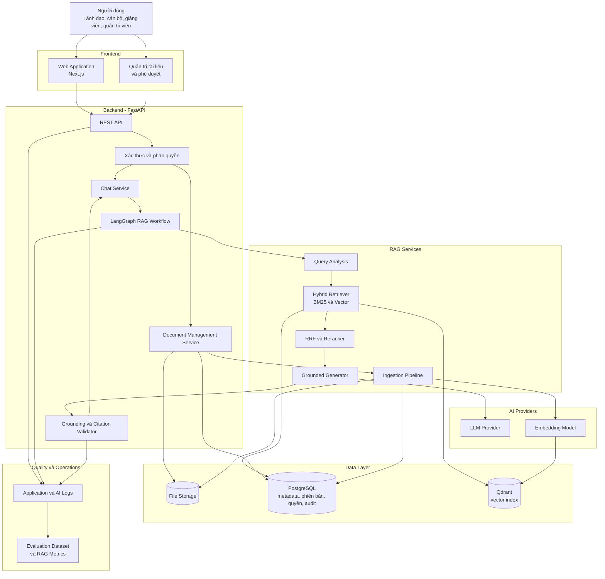
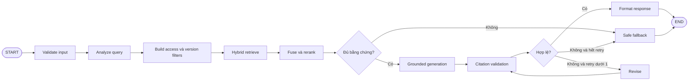
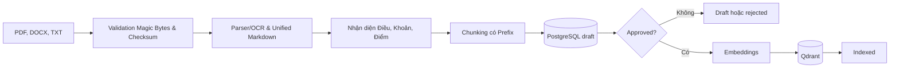
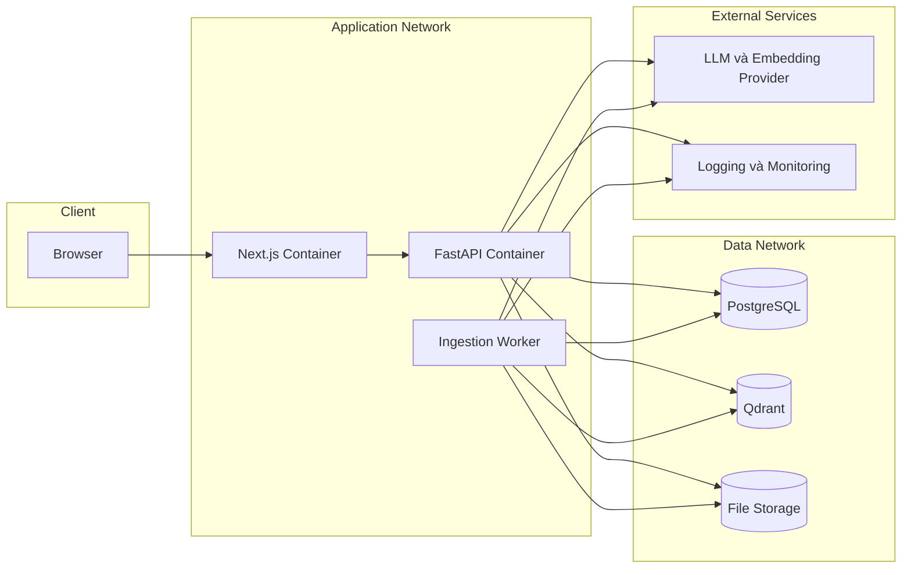

# Kiến trúc hệ thống — PolicyMeta AI

## 1. Tổng quan

PolicyMeta AI là trợ lý tra cứu quy định, quy chế nội bộ dành cho lãnh đạo, cán bộ, nhân viên và giảng viên. Hệ thống sử dụng kiến trúc Retrieval-Augmented Generation (RAG): truy xuất các điều khoản phù hợp từ kho tài liệu đã được phê duyệt, sau đó dùng mô hình ngôn ngữ để tổng hợp câu trả lời có trích dẫn.

Kiến trúc ưu tiên bốn yêu cầu: chọn đúng phiên bản văn bản, kiểm soát quyền truy cập, hạn chế suy diễn ngoài nguồn và cho phép người dùng kiểm chứng từng kết luận. PostgreSQL là nguồn dữ liệu chuẩn; Qdrant đóng vai trò chỉ mục vector có thể tái tạo.

## 2. Mục tiêu và phạm vi kiến trúc

### Trong phạm vi MVP

- Hỏi đáp bằng ngôn ngữ tự nhiên trên kho quy định, quy chế nội bộ.
- Nhập tài liệu PDF, DOCX và TXT; hỗ trợ OCR khi cần.
- Quản lý metadata, phiên bản, hiệu lực, quan hệ thay thế và trạng thái phê duyệt.
- Hybrid retrieval kết hợp tìm kiếm từ khóa và vector.
- Sinh câu trả lời có trích dẫn đến văn bản, điều, khoản hoặc đoạn nguồn.
- Trả cảnh báo khi tài liệu không đủ căn cứ, có mâu thuẫn hoặc chưa rõ hiệu lực.
- Ghi log và đánh giá answer correctness, citation correctness, groundedness và retrieval quality.

### Ngoài phạm vi module RAG

- Đăng nhập và quản lý phiên người dùng.
- Giao diện web và màn hình phê duyệt tài liệu.
- Chính sách tổ chức chi tiết; RAG chỉ nhận `UserContext` đã được backend chuẩn hóa.
- Tự động đưa ra quyết định nghiệp vụ thay cho người có thẩm quyền.

## 3. Sơ đồ kiến trúc tổng thể



## 4. Các thành phần chính

### 4.1. Frontend — Next.js

**Trách nhiệm**

- Cung cấp giao diện hỏi đáp và hiển thị phản hồi theo luồng.
- Hiển thị citation, excerpt, cảnh báo, mức confidence và liên kết đến tài liệu nguồn.
- Cung cấp màn hình quản trị cho upload, metadata, phê duyệt và quản lý phiên bản.
- Không truy cập trực tiếp database hoặc vector store.

**Trạng thái giao diện**

- Server state lấy qua API; có thể dùng cơ chế cache/query phù hợp của Next.js.
- Conversation state chỉ giữ dữ liệu cần cho trải nghiệm người dùng; nguồn dữ liệu chuẩn của tài liệu không nằm ở frontend.

### 4.2. Backend — FastAPI

**Trách nhiệm**

- Cung cấp REST API và streaming response cho chat.
- Validate request bằng Pydantic, chuẩn hóa lỗi và áp dụng rate limit.
- Xác thực người dùng, xây dựng `UserContext` và kiểm tra quyền ở cấp endpoint.
- Điều phối Chat Service, Document Management Service và LangGraph workflow.
- Không để frontend gửi trực tiếp các bộ lọc quyền có thể tự nâng đặc quyền.

**Endpoint dự kiến**

| Method | Path | Mục đích |
|---|---|---|
| `GET` | `/health` | Kiểm tra trạng thái dịch vụ |
| `POST` | `/api/v1/chat` | Gửi câu hỏi và nhận answer có citations |
| `POST` | `/api/v1/documents` | Upload tài liệu và metadata |
| `GET` | `/api/v1/documents` | Tra cứu danh sách, phiên bản và trạng thái |
| `POST` | `/api/v1/documents/{version_id}/approve` | Phê duyệt hoặc từ chối phiên bản |
| `POST` | `/api/v1/documents/{version_id}/reindex` | Lập chỉ mục lại phiên bản đã phê duyệt |

Các endpoint quản trị phải yêu cầu vai trò phù hợp và ghi audit log.

### 4.3. AI Agent — LangGraph

**Kiểu workflow:** stateful RAG workflow tùy biến, không phụ thuộc hoàn toàn vào ReAct.

**State đề xuất**

```python
class AgentState(TypedDict):
    question: str
    user_context: dict
    conversation_context: list[dict]
    as_of_date: str | None
    search_mode: str
    query_plan: dict
    retrieved_chunks: list[dict]
    selected_chunks: list[dict]
    draft_answer: str | None
    citations: list[dict]
    warnings: list[str]
    confidence: float
    validation_result: dict
    retry_count: int
```

**Các node chính**

1. `validate_input`
2. `analyze_query`
3. `build_filters`
4. `hybrid_retrieve`
5. `fuse_and_rerank`
6. `check_evidence`
7. `generate_grounded_answer`
8. `validate_citations`
9. `revise_or_fallback`
10. `format_response`

**Luồng agent**



### 4.4. Ingestion Pipeline

**Trách nhiệm**

- Kiểm tra loại file, kích thước, checksum, kiểm tra Magic Bytes (chống giả mạo/file hỏng) và trùng lặp.
- Parse text và chuyển đổi tài liệu sang dạng Markdown thống nhất (Unified Markdown Intermediate Representation); dùng OCR cho tài liệu scan khi cần.
- Nhận diện cấu trúc chương, mục, điều, khoản, điểm từ định dạng Markdown.
- Tạo chunk có metadata, context prefix và liên kết ngược đến section gốc.
- Lưu bản nháp vào PostgreSQL trước khi phê duyệt.
- Chỉ tạo embeddings và upsert Qdrant sau khi phiên bản được phê duyệt.
- Bảo đảm idempotency khi retry hoặc re-index.



### 4.5. Hybrid Retriever

Hybrid Retriever kết hợp:

- **Keyword retrieval:** PostgreSQL full-text search hoặc chỉ mục BM25 tương đương, phù hợp với số hiệu văn bản, thuật ngữ pháp quy và cụm từ chính xác.
- **Vector retrieval:** Qdrant, phù hợp với câu hỏi diễn đạt khác từ ngữ trong văn bản.
- **Filter:** `approval_status`, `index_status`, hiệu lực, trạng thái phiên bản, vai trò, đơn vị và access level.
- **Fusion:** Reciprocal Rank Fusion để hợp nhất hai danh sách.
- **Rerank:** mô hình hoặc quy tắc xếp hạng lại top candidates trước khi đưa vào context.

### 4.6. Grounded Generator và Citation Validator

Generator chỉ nhận các chunk đã qua filter và rerank. Prompt phải yêu cầu:

- Không sử dụng kiến thức ngoài context để khẳng định quy định nội bộ.
- Phân biệt nội dung được quy định rõ với phần diễn giải.
- Không che giấu mâu thuẫn giữa các nguồn.
- Gắn citation cho từng kết luận quan trọng.

Citation Validator kiểm tra:

- Citation tham chiếu đến `document_id`, `version_id`, `section_id` và `chunk_id` tồn tại.
- Người dùng có quyền xem nguồn được trích dẫn.
- Trích đoạn hỗ trợ trực tiếp cho nội dung câu trả lời.
- Phiên bản phù hợp với `as_of_date` và `search_mode`.
- Không có kết luận quan trọng không được nguồn hỗ trợ.

### 4.7. PostgreSQL

**Mục đích:** nguồn dữ liệu chuẩn cho nghiệp vụ và truy vết.

**Các bảng logic chính**

| Bảng | Nội dung |
|---|---|
| `documents` | Danh tính ổn định của văn bản |
| `document_versions` | File, checksum, hiệu lực, phê duyệt, trạng thái index và quan hệ phiên bản |
| `sections` | Cấu trúc chương, điều, khoản, điểm |
| `chunks` | Đơn vị truy xuất và ánh xạ đến section |
| `document_relations` | Thay thế, sửa đổi, bổ sung hoặc liên quan |
| `access_policies` | Phạm vi truy cập theo vai trò và đơn vị |
| `approval_records` | Lịch sử phê duyệt hoặc từ chối |
| `ingestion_jobs` | Trạng thái parse, OCR, embedding và index |
| `audit_logs` | Thao tác quản trị và thay đổi dữ liệu quan trọng |

**Migrations:** Alembic.

### 4.8. Qdrant

**Mục đích:** tìm kiếm ngữ nghĩa trên embeddings của chunk.

Mỗi point chứa vector và payload phục vụ filter: `chunk_id`, `version_id`, trạng thái phê duyệt, trạng thái phiên bản, ngày hiệu lực, access level, allowed roles và allowed units.

Qdrant không lưu quyết định phê duyệt độc lập. Nếu PostgreSQL và Qdrant không nhất quán, dữ liệu PostgreSQL được ưu tiên và phiên bản liên quan phải được re-index.

### 4.9. LLM và Embedding Provider

- Truy cập qua lớp abstraction để có thể thay provider hoặc model theo cấu hình môi trường.
- Model name, timeout, retry, token limit và chi phí phải được cấu hình, không hard-code trong workflow.
- Nội dung nhạy cảm chỉ được gửi đến provider phù hợp với chính sách dữ liệu của đơn vị triển khai.

## 5. Luồng dữ liệu

### 5.1. Luồng hỏi đáp

1. Người dùng gửi câu hỏi từ Web Application.
2. FastAPI xác thực request và tạo `UserContext` từ thông tin đáng tin cậy phía server.
3. LangGraph phân tích câu hỏi, phạm vi thời gian và loại truy vấn hiện hành hoặc lịch sử.
4. Retriever áp dụng filter quyền, phê duyệt, hiệu lực và phiên bản.
5. Hệ thống chạy keyword search và vector search, sau đó RRF và rerank.
6. Nếu nguồn không đủ, hệ thống trả cảnh báo không đủ căn cứ.
7. Nếu nguồn đủ, LLM sinh câu trả lời chỉ từ selected chunks.
8. Citation Validator kiểm tra grounding, citation và quyền truy cập.
9. Backend trả `answer`, `citations`, `warnings`, `confidence` và metadata cần thiết cho frontend.
10. Logs phục vụ quan sát và đánh giá được ghi lại sau khi loại bỏ hoặc che dữ liệu nhạy cảm.

### 5.2. Luồng quản trị tài liệu

1. Quản trị viên upload file và nhập metadata.
2. Backend kiểm tra file, checksum và tạo `document_version` ở trạng thái draft.
3. Ingestion Pipeline parse, OCR, nhận diện cấu trúc và tạo chunks.
4. Data owner xem nội dung đã xử lý và phê duyệt hoặc từ chối.
5. Phiên bản được phê duyệt mới được tạo embeddings và upsert Qdrant.
6. Khi phiên bản mới thay thế phiên bản cũ, hệ thống cập nhật quan hệ và trạng thái `superseded` trong cùng transaction nghiệp vụ phù hợp.
7. Phiên bản cũ vẫn tồn tại cho truy vấn lịch sử nhưng không được lấy trong truy vấn hiện hành.

## 6. Quy tắc quản lý phiên bản và hiệu lực

- `documents` đại diện cho văn bản ở mức danh tính; mỗi file hoặc lần ban hành là một `document_version`.
- Checksum dùng để phát hiện file trùng, không thay thế version number hoặc số hiệu văn bản.
- Phiên bản hiện hành phải đồng thời thỏa: approved, indexed, không bị superseded và có hiệu lực tại `as_of_date`.
- `effective_to` để trống nghĩa là chưa xác định ngày hết hiệu lực, không tự động đồng nghĩa với đang có hiệu lực nếu trạng thái phiên bản không phù hợp.
- Truy vấn lịch sử phải truyền rõ `as_of_date` hoặc `search_mode = historical`.
- Mâu thuẫn metadata phải tạo warning và không được âm thầm chọn một nguồn thiếu căn cứ.

## 7. Hợp đồng phản hồi chat

```json
{
  "answer": "Nội dung trả lời đã được grounding",
  "citations": [
    {
      "document_id": "uuid",
      "version_id": "uuid",
      "document_number": "string",
      "title": "string",
      "structure_path": "Điều 5, Khoản 2",
      "chunk_id": "uuid",
      "excerpt": "Trích đoạn hỗ trợ câu trả lời",
      "source_uri": "string"
    }
  ],
  "warnings": [],
  "confidence": 0.0,
  "request_id": "uuid"
}
```

`confidence` là tín hiệu đã được hiệu chỉnh bằng dữ liệu đánh giá, không phải mức tin cậy do LLM tự khai báo. Frontend luôn ưu tiên hiển thị citation và warning thay vì chỉ hiển thị một con số.

## 8. Kiến trúc triển khai



### Môi trường

- **Development:** có thể dùng PostgreSQL và Qdrant qua Docker Compose; SQLite chỉ nên dùng cho thử nghiệm cục bộ không cần đầy đủ versioning, full-text search và concurrency.
- **Production:** PostgreSQL, Qdrant và file storage tách biệt; secrets được cấp qua secret manager hoặc biến môi trường của nền tảng triển khai.
- Ingestion nên chạy ở worker riêng để không chặn request chat và để hỗ trợ retry.

## 9. Bảo mật

- API keys và database credentials không commit vào repository.
- Validate input bằng Pydantic; giới hạn kích thước file, MIME type và tên file.
- CORS chỉ cho phép domain frontend được cấu hình.
- Áp dụng rate limiting cho endpoint chat, upload và re-index.
- `UserContext` được tạo ở backend; không tin cậy role hoặc unit do client tự gửi.
- Filter quyền được áp dụng trong retrieval và được kiểm tra lại trước khi trả citation hoặc excerpt.
- Audit log cho upload, chỉnh metadata, phê duyệt, từ chối, supersede, re-index và delete.
- Log không lưu nguyên văn tài liệu hoặc câu hỏi nhạy cảm nếu chưa có chính sách cho phép; ưu tiên mask, hash hoặc sampling.
- File upload cần được kiểm tra nội dung độc hại theo khả năng của hạ tầng triển khai.
- Prompt injection từ tài liệu được coi là dữ liệu, không phải chỉ thị hệ thống; prompt và tool policy phải tách biệt rõ.

## 10. Quan sát và đánh giá

### Metrics vận hành

- API latency và error rate.
- Thời gian retrieval, rerank, generation và validation.
- Số candidate, số selected chunks và tỷ lệ không đủ bằng chứng.
- Tỷ lệ ingestion thành công, lỗi parser/OCR và lỗi đồng bộ Qdrant.
- Token usage và chi phí theo request hoặc model.

### Metrics chất lượng

- Answer correctness.
- Citation correctness và citation completeness.
- Groundedness hoặc faithfulness.
- Retrieval recall/precision trên tập câu hỏi chuẩn.
- Document/version selection accuracy.
- Access-control leakage rate phải bằng 0 trong bộ kiểm thử quyền.

Kết quả đánh giá được lưu trong `eval/` và phải gắn với dataset version, cấu hình retrieval, prompt version và model version để có thể so sánh lại.

## 11. Xử lý lỗi và tính nhất quán

- Mọi ingestion job có trạng thái, thời điểm bắt đầu/kết thúc và lỗi có thể truy vết.
- Upsert Qdrant phải idempotent theo `chunk_id` hoặc point id ổn định.
- Khi index lỗi, `index_status` không được chuyển sang indexed; tài liệu chưa sẵn sàng không được retrieval.
- Khi xóa hoặc supersede phiên bản, cập nhật PostgreSQL trước và chạy job đồng bộ Qdrant; retrieval luôn filter theo trạng thái từ metadata đáng tin cậy.
- Khi LLM hoặc reranker lỗi, backend trả lỗi có kiểm soát hoặc fallback retrieval-only, không tạo câu trả lời không có nguồn.
- Citation validation chỉ retry giới hạn để tránh vòng lặp và tăng latency không kiểm soát.

## 12. Quyết định thiết kế

| Quyết định | Lựa chọn | Lý do |
|---|---|---|
| Backend framework | FastAPI | Async, Pydantic, OpenAPI và phù hợp pipeline Python |
| Frontend | Next.js | Phù hợp web app, streaming UI và màn hình quản trị |
| Agent orchestration | LangGraph | State rõ ràng, branching, retry có kiểm soát và dễ quan sát |
| Database chính | PostgreSQL | Transaction, quan hệ phiên bản, JSON metadata, full-text search và audit |
| Vector store | Qdrant | Vector search có payload filter, phù hợp access/effective-date filtering |
| Retrieval | Hybrid BM25/full-text + vector | Bao phủ cả thuật ngữ chính xác và câu hỏi diễn đạt tự nhiên |
| Fusion | RRF + rerank | Giảm lệ thuộc vào một retriever và cải thiện thứ hạng context |
| Source of truth | PostgreSQL | Tránh trạng thái nghiệp vụ bị phân tán giữa database và vector store |
| Human approval | Bắt buộc trước indexing | Giảm rủi ro dùng tài liệu sai, chưa hoàn chỉnh hoặc chưa được xác nhận |
| Citation validation | Bắt buộc trước response | Hỗ trợ mục tiêu grounded và khả năng kiểm chứng |
| Model integration | Provider abstraction | Dễ thay model, kiểm soát chi phí và tuân thủ chính sách dữ liệu |

## 13. Tài liệu liên quan

- `architecture_diagram.md`: sơ đồ tổng thể, luồng chat và luồng nhập tài liệu.
- `rag_database_architecture.md`: chi tiết ingestion, retrieval, schema logic và hợp đồng module RAG.
- `README.md`: phạm vi sản phẩm, mục tiêu, cách chạy và cấu trúc repository.
- `README_RAG_DATABASE.md`: hướng dẫn triển khai hoặc vận hành dữ liệu RAG khi được cập nhật.
