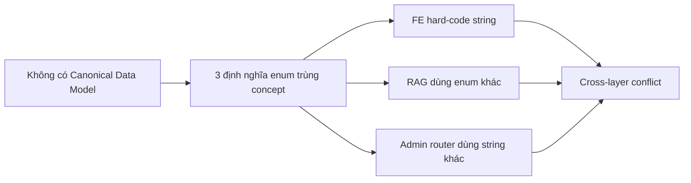
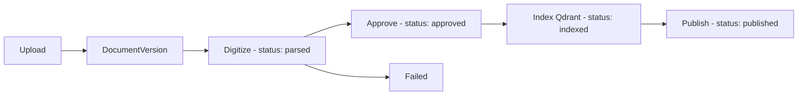

# AUDIT_SUMMARY.md — Tóm tắt Audit chéo các layer (lịch sử)

> Ngày audit: 2026-08-30
> Phạm vi: Toàn bộ conflict phát hiện giữa code, DB schema, RAG, FE, docs.
> Trạng thái: Lỗi P0/P1 đã được sửa hoặc có kế hoạch xử lý. File này là **bản tóm tắt lịch sử** — không dùng làm nguồn quyết định hiện tại.

---

## 1. Nguyên nhân gốc



Cụ thể:

| Enum | Layer A (Vietnamese) | Layer B (English) | Layer C (string literal) |
|---|---|---|---|
| Processing status | `CHO_XU_LY_NOI_DUNG`, `DANG_SO_HOA`, ... | `RECEIVED`, `QUEUED`, ... | `"Indexed"`, `"Approved"`, ... |
| Legal status | `DANG_HIEU_LUC`, `BI_THAY_THE`, ... | `DRAFT`, `EFFECTIVE`, ... | — |
| Access scope | `PUBLIC`, `DEPARTMENT` | `PUBLIC`, `INTERNAL`, `DEPARTMENT`, `RESTRICTED` | — |

---

## 2. Tổng hợp conflict theo severity

| Severity | Count | Mô tả |
|---|---:|---|
| P0 | 3 | Endpoint missing, legacy routes, enum multiplication |
| P1 | 5 | Semantic mismatch, naming drift |
| P2 | 8 | Field thiếu/khác tên |
| P3 | 4 | Tài liệu lệch code |

**Trạng thái hiện tại:**

- P0 (3/3): đã xử lý hoặc có trong backlog rõ ràng.
- P1 (5/5): canonical enums đã thống nhất.
- P2/P3: còn một số legacy field (`owner_department`, `allowed_departments` JSON) — không ảnh hưởng runtime.

---

## 3. P0 — đã xử lý

| ID | Vấn đề | Trạng thái |
|---|---|---|
| C-001 | Endpoint thiếu (`previewMetadata`, `fetchVersionStatus`) | ✅ Mounted legacy routes |
| C-002 | `src/api/admin_routes.py` không import trong `main.py` | ✅ Mounted hoặc migrated |
| C-003 | ProcessingStatus trùng định nghĩa | ✅ Canonical enum ở `schemas.py` |

---

## 4. P1 — đã xử lý canonical

| ID | Vấn đề | Trạng thái |
|---|---|---|
| C-004 | LegalStatus Vietnamese vs English | ✅ Canonical English |
| C-005 | AccessLevel vs AccessScope | ✅ Canonical `AccessScope` 2-value |
| C-006 | Admin router string literal capitalized | ✅ Enum-based |
| C-007 | FE hard-code Vietnamese label | ✅ FE nhận key từ BE |
| C-008 | RAG status vs backend status | ✅ Status đồng bộ |

---

## 5. Quyết định kiến trúc đã chốt (tóm tắt)

| ID | Quyết định | Chốt |
|---|---|---|
| D-001 | Status language: English | ✅ |
| D-002 | Hai enum riêng (processing + legal) | ✅ |
| D-003 | FE i18n: BE trả key, FE render label | ✅ |
| D-004 | Pydantic cho schema | ✅ |
| D-005 | Migrate legacy routes | ✅ |
| D-006 | AccessScope 2 value (PUBLIC/DEPARTMENT) | ✅ |
| D-007 | `school_id` (UUID) chỉ là tenant context; role phân theo **RBAC identity** | ✅ |

---

## 6. Worker contract (tóm tắt)



Đã đồng bộ: status flow khớp giữa backend và RAG; RAG chỉ accept `approved` hoặc `published`.

---

## 7. RAG data contract (tóm tắt)

Qdrant payload (multi-tenant safe):

```json
{
  "tenant_id": "hust",
  "document_id": "...",
  "version_id": "...",
  "status": "published",
  "classification": "public|internal|department|restricted",
  "allowed_units": ["HUST", "..."]
}
```

Filter tối thiểu:

```text
tenant_id == current_tenant
AND status == "published"
AND document_id IN allowed_document_ids
```

---

## 8. RBAC identity (chuẩn hiện tại)

**Quan trọng:** Vai trò KHÔNG được suy ra t� `school_id` UUID. Phân theo **RBAC identity** (`school_code` t� form đăng ký):

| `school_code` | `role` | `department_id` |
|---|---|---|
| `ADMIN` | ADMIN | NULL |
| `HUST` | USER | HUST |
| `HUCE` | USER | HUCE |
| khác | USER | lookup theo `school_code` |

`school_id` chỉ dùng cho JWT claim, audit, trace — **không quyết định role**.

---

## 9. Open items (không chặn release)

- Một số DB column legacy (`owner_department`, `allowed_departments` JSON) tồn tại nhưng không dùng — giữ lại để không phá backward compat.
- Frontend i18n labels cho status — render mapping trong FE, BE không trả label.

---

## 10. File nguồn (đã nén)

Các file dưới đây đã được nén vào tài liệu này. Nếu cần chi tiết từng conflict ID:

- `CROSS_LAYER_AUDIT.md` → §1, §2
- `CROSS_LAYER_CONFLICT_REGISTER.md` → §3, §4
- `BACKEND_DATA_DRIFT.md` → §3, §4
- `SPEC_REWRITE_PLAN.md` → §5
- `DATA_CONTRACT_MATRIX.md` → §3
- `HUMAN_DECISIONS.md` → §5
- `SECURITY_CONTEXT_FLOW.md` → §7
- `WORKER_CONTRACT_AUDIT.md` → §6
- `DOMAIN_MODEL.md` → §3, §4
- `DATA_OWNERSHIP.md` → §7
- `RAG_DATA_CONTRACT.md` → §7
- `API_CONTRACT_AUDIT.md` → §3, §4

Nếu cần tra cứu sâu một conflict, mở file tương ứng trong git history.

---

## 11. Phase 0 audit (31/08/2026) — end-to-end refactor

> Pass khởi đầu cho plan `P-234 — Kế hoạch Refactor & Hoàn thiện end-to-end`. Mục đích: biết key env nào thật sự dùng, test nào mock, file `.md` nào sai thực tế.

### 11.1 Env keys audit

| Trạng thái | Key | File dùng | Ghi chú |
|---|---|---|---|
| Dùng trong code | `database_url` | [src/config.py](src/config.py), [src/rag/config.py](src/rag/config.py) | Chia sẻ backend + RAG (Neon). |
| Dùng | `redis_url` | [src/config.py](src/config.py), [src/presentation/api/dependencies/redis.py](src/presentation/api/dependencies/redis.py) | Docker (`redis://redis:6379/0`) hoặc local (`localhost`). |
| Dùng | `r2_endpoint`, `r2_access_key_id`, `r2_secret_access_key`, `r2_bucket_name` | [src/infrastructure/dependency_injection/dependency_injection.py](src/infrastructure/dependency_injection/dependency_injection.py) | Cloudflare R2 thật, fallback LocalFileStorage khi rỗng. |
| Dùng | `jwt_*` | [src/infrastructure/auth/jwt_token_service.py](src/infrastructure/auth/jwt_token_service.py) | 5 key. |
| Dùng | `openai_api_key`, `model_name`, `llm_temperature` | [src/services/llm_factory.py](src/services/llm_factory.py) | Multi-provider. |
| Dùng | `app_env`, `app_port`, `app_host`, `log_level`, `cors_origins` | [src/main.py](src/main.py), [src/api/auth.py](src/api/auth.py) | Runtime. |
| Dùng | `dev_auth_bypass` | [src/api/auth.py](src/api/auth.py) | Chỉ `development`. |
| **Hardcoded** (không env) | `school_id`, `school_code` | [src/config.py](src/config.py) (`TENANT_ID`/`TENANT_CODE`) | Single-tenant demo, không đọc từ env. Đã xác nhận không có key `SCHOOL_ID`/`SCHOOL_CODE` trong `.env*`. |
| Dùng (RAGSettings) | Toàn bộ block `EMBEDDING_*`, `QDRANT_*`, `RERANKER_*`, `CHUNK_*`, `PARSER_*`, `OCR_*`, v.v. | [src/rag/config.py](src/rag/config.py) | Khớp 1:1 giữa `.env.rag` và `.env.rag.example`. |

**Kết luận:** `.env` ↔ `.env.example` và `.env.rag` ↔ `.env.rag.example` đã đồng bộ key. Key `SCHOOL_ID`/`SCHOOL_CODE` đã **không còn trong env** (đúng kỳ vọng user). Không cần xoá/bổ sung key env ở Phase 1.

### 11.2 Tests audit (mock/fake)

| File | Vấn đề |
|---|---|
| [tests/conftest.py](tests/conftest.py) | Mock auth/JWT — viết lại bằng fixture thật. |
| [tests/test_api/test_routes.py](tests/test_api/test_routes.py) | Patch services — viết lại integration qua HTTP. |
| [tests/test_rag/*](tests/test_rag/) (8 file) | Dùng `Mock`/`patch`/`monkeypatch` để fake Qdrant/Postgres — viết lại chạy thật trên Qdrant Cloud + Neon. |
| [tests/test_ingestion/*](tests/test_ingestion/) (2 file) | Patch parser/chunker — viết lại. |
| [tests/test_services/test_embedding_resilient.py](tests/test_services/test_embedding_resilient.py) | Mock OpenAI client — viết lại chạy thật (key thật đã có). |
| [tests/test_services/test_retry_utils.py](tests/test_services/test_retry_utils.py) | Mock time/sleep — chấp nhận (mock pure utility OK). |
| [tests/test_agents/test_rag_tools.py](tests/test_agents/test_rag_tools.py) | Mock vector store — viết lại chạy thật. |

Tổng: **52 file test, 24 file dùng mock/fake**. Phase 2 sẽ xoá hoặc viết lại.

### 11.3 Code enum audit (Vietnamese literal + legacy)

| Vấn đề | File |
|---|---|
| `DANG_HIEU_LUC` (Vietnamese) | [src/db/repository.py](src/db/repository.py), [src/scripts/seed_a0_01_demo.py](src/scripts/seed_a0_01_demo.py), [src/scripts/test_a0_01_repository.py](src/scripts/test_a0_01_repository.py), [src/scripts/test_e2e_doc_lifecycle.py](src/scripts/test_e2e_doc_lifecycle.py), [src/scripts/test_e2e_ingestion.py](src/scripts/test_e2e_ingestion.py), [src/scripts/e2e_full_smoke.py](src/scripts/e2e_full_smoke.py), [src/scripts/ingest_raw_pdfs.py](src/scripts/ingest_raw_pdfs.py), [src/scripts/_local/ingest_with_timing.py](src/scripts/_local/ingest_with_timing.py), [src/scripts/_local/ingest_hust_corpus.py](src/scripts/_local/ingest_hust_corpus.py), [src/scripts/seed_docker_db.py](src/scripts/seed_docker_db.py), [migrations/versions/0001_initial.py](migrations/versions/0001_initial.py), [migrations/versions/0002_add_rag_tables.py](migrations/versions/0002_add_rag_tables.py) |
| `access_level` 4-value enum | [src/db/repository.py](src/db/repository.py), [src/db/models.py](src/db/models.py), [src/ingestion/pipeline.py](src/ingestion/pipeline.py), [src/ingestion/chunker.py](src/ingestion/chunker.py), [src/application/features/document_digitization/digitize/digitize_document_handler.py](src/application/features/document_digitization/digitize/digitize_document_handler.py), [src/application/features/regulatory_documents/update/update_regulatory_document_handler.py](src/application/features/regulatory_documents/update/update_regulatory_document_handler.py), [src/security/metadata_contract.py](src/security/metadata_contract.py), [src/rag/citation_validator.py](src/rag/citation_validator.py), [src/rag/container.py](src/rag/container.py), [src/persistence/tenant/repositories/sqlalchemy_document_relation_repository.py](src/persistence/tenant/repositories/sqlalchemy_document_relation_repository.py), [src/infrastructure/ai/hybrid_retrieval_service.py](src/infrastructure/ai/hybrid_retrieval_service.py), [src/infrastructure/ai/document_digitization_service.py](src/infrastructure/ai/document_digitization_service.py), [src/evaluation/regression_seed.py](src/evaluation/regression_seed.py), [src/domain/enums/document_legal_status.py](src/domain/enums/document_legal_status.py), [src/domain/enums/document_processing_status.py](src/domain/enums/document_processing_status.py), [src/domain/schemas.py](src/domain/schemas.py) |

**Kết luận:** cần Phase 2 thay hết sang canonical English (`LegalStatus.EFFECTIVE`, `AccessScope.PUBLIC/DEPARTMENT`).

---

## 12. Cập nhật 2026-09-03 — Phase 1-3: Register disable + Landing + Saved Docs + Notifications + 2-cấp Approval

### 12.1 Thay đổi lớn

| Feature | Backend files | Frontend files | Docs updated |
|---|---|---|---|
| Disable register | `auth_router.py` (→ 403) | `login/page.tsx` (xóa link), `register/page.tsx` (thông báo + redirect) | `PLAN.md`, `docs/FLOW_HE_THONG_P234.md` |
| Landing page | — | `app/page.tsx` (public landing) | `PLAN.md` |
| Saved documents | Entity, repo, handlers, router | `savedDocumentService.ts`, `saved/page.tsx`, `DocumentDetailActions.tsx` | `PLAN.md` |
| Notifications | Entity, repo, handlers, router, `NotificationType` enum | `notificationService.ts`, `useNotifications.ts`, `notifications/page.tsx`, `StudentHeader.tsx` | `PLAN.md`, `BACKEND_ARCHITECTURE.md`, `BACKEND_BEHAVIOR.md` |
| 2-cấp approval | `PENDING_REVIEW`, `PENDING_APPROVAL`, `REJECTED` added to `ProcessingStatus`; review handlers | `StatusBadge.tsx`, `admin/review/page.tsx` | `docs/DATA_PROCESSING_FLOW.md`, `PLAN.md`, `USE_CASES.md` |
| Document validation | `src/domain/validators/document_validator.py` | — | `PLAN.md` |

### 12.2 ProcessingStatus enum updates (Phase 3b)

```python
# src/domain/schemas.py
class ProcessingStatus(StrEnum):
    RECEIVED = "received"
    QUEUED = "queued"
    QUARANTINED = "quarantined"
    PARSED = "parsed"
    REVIEW_REQUIRED = "review_required"
    PENDING_REVIEW = "pending_review"       # NEW
    PENDING_APPROVAL = "pending_approval"  # NEW
    APPROVED = "approved"
    REJECTED = "rejected"                 # NEW
    INDEXED = "indexed"
    PUBLISHED = "published"
    FAILED = "failed"
```

### 12.3 State machine (Phase 3b)

```
REVIEW_REQUIRED ──metadata invalid──> PENDING_REVIEW ──complete-review──> PENDING_APPROVAL
                                    │                                    │
                                    └──reject──> REJECTED  ├──approve──> APPROVED
                                                                       └──reject──> REJECTED
```

### 12.4 API endpoints mới

| Method | Endpoint | Handler |
|---|---|---|
| POST | `/saved-documents/{id}` | SaveDocumentHandler |
| DELETE | `/saved-documents/{id}` | UnsaveDocumentHandler |
| GET | `/saved-documents` | ListSavedDocumentsHandler |
| GET | `/notifications` | ListNotificationsHandler |
| GET | `/notifications/unread-count` | GetUnreadCountHandler |
| POST | `/notifications/{id}/read` | MarkNotificationReadHandler |
| POST | `/notifications/read-all` | MarkAllNotificationsReadHandler |
| POST | `/admin/documents/{id}/complete-review` | CompleteReviewHandler |
| POST | `/admin/documents/{id}/reject` | RejectDocumentHandler |
| POST | `/admin/documents/{id}/republish` | RepublishDocumentHandler |

### 12.5 Database migrations

| File | Description |
|---|---|
| `database/migrations/002_create_saved_documents.sql` | saved_documents table |
| `database/migrations/003_create_notifications.sql` | notifications table |
| `database/migrations/004_add_review_columns.sql` | review_notes, reviewed_by, reviewed_at on document_versions |

### 12.6 Files mới (Backend)

- `src/domain/entities/saved_document.py`
- `src/domain/entities/notification.py`
- `src/domain/repositories/saved_document_repository.py`
- `src/domain/repositories/notification_repository.py`
- `src/persistence/tenant/models/saved_document.py`
- `src/persistence/tenant/models/notification.py`
- `src/persistence/tenant/repositories/sqlalchemy_saved_document_repository.py`
- `src/persistence/tenant/repositories/sqlalchemy_notification_repository.py`
- `src/application/features/saved_documents/save/*.py`
- `src/application/features/saved_documents/unsave/*.py`
- `src/application/features/saved_documents/list/*.py`
- `src/application/features/notifications/list/*.py`
- `src/application/features/notifications/mark_read/*.py`
- `src/application/features/notifications/mark_all_read/*.py`
- `src/application/features/notifications/get_unread_count/*.py`
- `src/application/features/notifications/notify_service.py`
- `src/application/features/documents/review/*.py`
- `src/application/features/documents/approve/*.py`
- `src/domain/validators/document_validator.py`
- `src/presentation/api/routers/saved_documents_router.py`
- `src/presentation/api/routers/notification_router.py`
- `src/presentation/api/contracts/saved_documents/*.py`
- `src/presentation/api/contracts/notifications/*.py`
- `src/presentation/api/contracts/admin/review_document_request.py`
- `src/presentation/api/contracts/admin/review_action_response.py`

### 11.4 Markdown audit (file sai thực tế)

| File | Vấn đề | Hành động |
|---|---|---|
| [BACKEND_BEHAVIOR.md](BACKEND_BEHAVIOR.md) §11.2 | Liệt kê `SCHOOL_ID, SCHOOL_CODE` và `TENANT_DATABASE_URL` là biến env chính — sai thực tế (hardcoded trong code, DB key là `DATABASE_URL`). | Auto-fix tại Phase 1 (đã xác nhận Phase 1). |
| [README_RAG_DATABASE.md](README_RAG_DATABASE.md), [docs/rag_database_architecture.md](docs/rag_database_architecture.md) | Có thể chồng chéo nội dung; kiểm tra kỹ ở Phase 4 khi reset DB. | Xem lại sau. |
| [README.md](README.md), [AGENTS.md](AGENTS.md), [BACKEND_ARCHITECTURE.md](BACKEND_ARCHITECTURE.md), [AUDIT_SUMMARY.md](AUDIT_SUMMARY.md), [USE_CASES.md](USE_CASES.md) | Đọc sơ qua — đúng kiến trúc hiện tại. | Giữ. |
| [WORKLOG.md](WORKLOG.md), [JOURNAL.md](JOURNAL.md), [PLAN.md](PLAN.md) | Cần cập nhật cuối mỗi phase. | Cập nhật ở các phase sau. |
| [docs/guide/](docs/guide/) | Còn dùng cho onboarding. | Giữ theo xác nhận user. |
| [docs/PDF_PROCESSING.md](docs/PDF_PROCESSING.md) + [docs/pdf_processing_pipeline.md](docs/pdf_processing_pipeline.md) | Hai file có thể chồng; chưa đọc kỹ. | Xem lại khi GĐ 5. |
| [docs/eval/results/*](docs/eval/results/) | Báo cáo benchmark cũ — chỉ là tài liệu lịch sử. | Giữ. |
| [P-234-Luu.zip](P-234-Luu.zip) | File zip backup ở root. | Đã có pattern `P-234-*.zip` trong `.gitignore`. Xoá nếu còn commit ở GĐ 8. |


