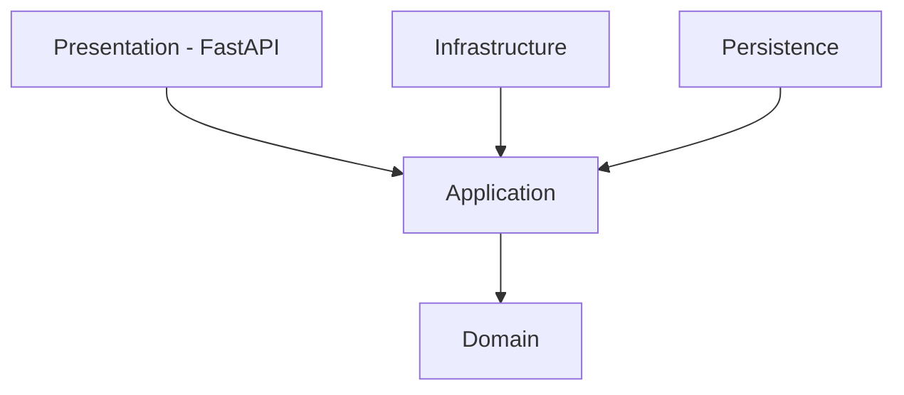
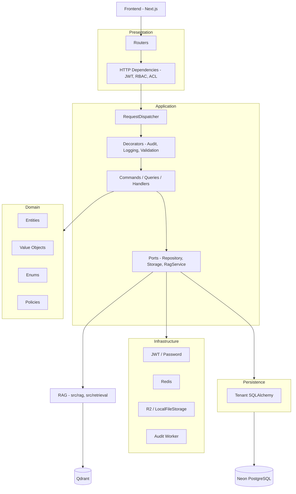
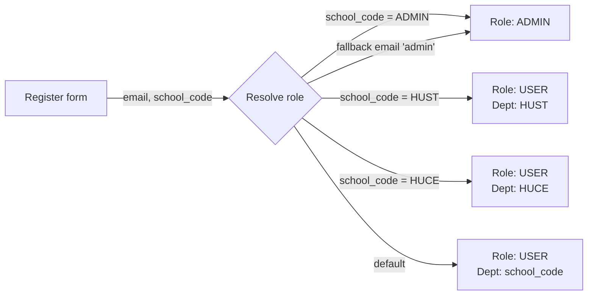
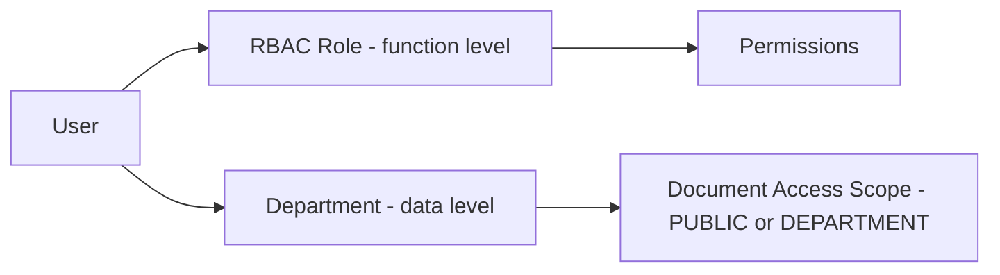
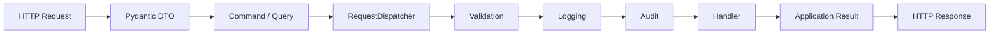
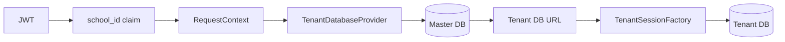
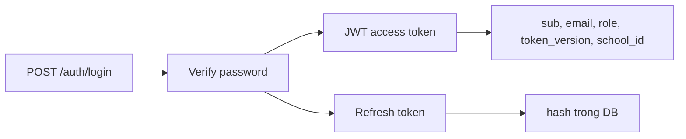
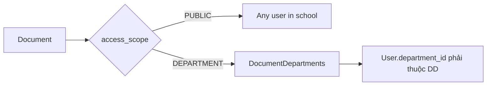
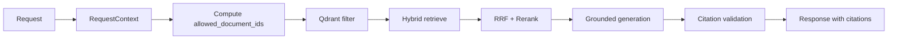
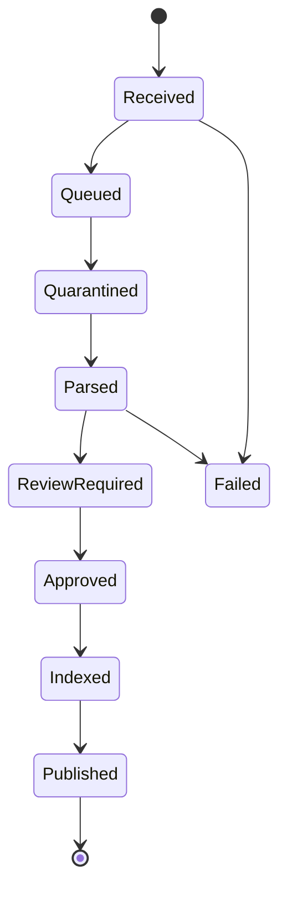

# P-234 Architecture — Canonical

> Status: Current (v20+)
> Phạm vi: Backend FastAPI + RAG tích h�p qua adapter.
> Nguyên tắc: Clean Architecture; Domain/Application không phụ thuộc FastAPI / SQLAlchemy / Qdrant / R2.

---

## 1. Mục tiêu

- Quản lý văn bản quy chế/quy định và RAG hỏi đáp có trích dẫn.
- Phân quyền theo **RBAC identity** (HUST / HUCE / ADMIN / LECTURER / ...) — KHÔNG phân role theo `school_id` UUID.
- Hai lớp phân quyền tách bạch:
  - **RBAC (function-level)** — role/permission quyết định chức năng.
  - **Department ACL (data-level)** — quyết định user đọc được tài liệu nào.
- Một demo database `p234_uc_demo` chứa toàn bộ nghiệp vụ; code sẵn sàng cho multi-school nhưng không phức tạp hóa demo.

---

## 2. Tech Stack

| Thành phần | Công nghệ |
|---|---|
| Language | Python 3.11+ |
| Framework | FastAPI |
| ORM | SQLAlchemy (async) |
| Migration | Alembic |
| Database | Neon PostgreSQL (`p234_uc_demo`) |
| File storage | Cloudflare R2 (fallback `LocalFileStorage`) |
| Vector store | Qdrant |
| Cache | Redis |
| Auth | JWT + Refresh Token rotation |
| RAG | Giữ pipeline hiện có (`src/rag`, `src/ingestion`, `src/retrieval`) |
| LLM | OpenAI GPT-4o-mini |

---

## 3. Dependency Rule



- `Domain` không biết FastAPI / SQLAlchemy / Qdrant / Neon / R2.
- `Application` chỉ phụ thuộc Domain + Protocol abstractions.
- `Infrastructure` và `Persistence` implement các Protocol của Application.

---

## 4. Kiến trúc tổng thể



---

## 5. RBAC Identity (chuẩn duy nhất)

Vai trò KHÔNG được suy ra từ `school_id` (UUID tenant). Vai trò được suy ra từ **RBAC identity** trong form đăng ký.



| `school_code` (form) | `role` | `department_id` |
|---|---|---|
| `ADMIN` | ADMIN | NULL (cross-school) |
| `HUST` | USER | HUST |
| `HUCE` | USER | HUCE |
| khác | USER | lookup theo `school_code` |

`school_id` (UUID) chỉ dùng cho:

- JWT claim (lấy từ `user.department_id`, không phải Settings)
- Audit/trace context
- Master DB routing (chưa kích hoạt trong demo)

### Hai lớp phân quyền



---

## 6. Cấu trúc thư mục

```text
src/
├── domain/
│   ├── entities/        # Document, User, Department, Role, Permission
│   ├── enums/           # canonical enums (ProcessingStatus, LegalStatus, AccessScope)
│   ├── repositories/    # Protocols
│   └── policies/        # access policies
├── application/
│   ├── common/          # interfaces, decorators, pipeline
│   ├── features/        # auth, documents, rbac, chat, ...
│   └── di/              # composition root
├── infrastructure/
│   ├── auth/            # JWT, password, refresh token
│   ├── cache/           # Redis
│   ├── storage/         # R2 / LocalFileStorage
│   ├── tenant/          # tenant provider
│   └── audit/           # audit worker
├── persistence/
│   ├── tenant/          # SQLAlchemy models + repositories
│   └── common/
├── presentation/
│   └── api/
│       ├── routers/
│       ├── dependencies/
│       └── exception_handlers/
├── rag/                 # giữ nguyên pipeline hiện có
├── ingestion/
├── retrieval/
└── main.py
```

---

## 7. Application Pipeline



Router mỏng — không chứa business logic, không query DB.

---

## 8. Multi-school (thiết kế nhưng demo đơn giản)



Demo hiện tại dùng 1 database duy nhất (`p234_uc_demo`). Code giữ abstraction để sau này bật multi-tenant mà không phải refactor lớn.

---

## 9. Authentication



JWT claims:

```text
sub           # user_id
email
role          # RBAC identity - quyết định permission
token_version # invalidation
school_id     # tenant context (UUID, từ user.department_id)
```

`role` trong JWT được lấy từ bảng `roles` theo `user_id`, **không suy ra từ `school_id`**.

---

## 10. RBAC Permission codes (seed)

| Role | Permissions |
|---|---|
| `ADMIN` | document.read, document.upload, document.update, document.delete, document.approve, document.process, document.audit.read, activity_log.read, chat.use, user.read, user.manage, rbac.manage, role.manage |
| `USER` | document.read, document.upload, document.process, document.approve, document.audit.read, activity_log.read, chat.use, user.read |

**Phase-5 RBAC expansion** (see approved "Comprehensive E2E" plan §2.3): the codes `document.approve`, `document.process`, `document.audit.read`, `activity_log.read`, `rbac.manage`, `role.manage` are referenced by admin/rbac/role/audit/system-evaluation routers. They must be seeded — without them those endpoints return 403 even for the seeded `ADMIN`. Stable UUIDs:

* `30000000-0000-0000-0000-000000000008` … `00000000000d` (production seeders)
* `10000000-0000-0000-0000-000000000008` … `00000000000d` (smoke-test reset)

---

## 11. Document ACL



- `PUBLIC`: user có permission `document.read` đọc được.
- `DEPARTMENT`: chỉ user thuộc department được gán qua `DocumentDepartments` mới đọc được.
- Policy fail-closed: thiếu thông tin → từ chối.

---

## 12. RAG Integration



Qdrant payload (multi-tenant safe):

```json
{
  "tenant_id": "hust",
  "document_id": "...",
  "version_id": "...",
  "status": "published",
  "classification": "public|internal|department|restricted",
  "allowed_units": ["HUST", "..."]
}
```

> **Lưu ý**: `tenant_id` được set từ `department.code` của user đang đăng nhập,
> không còn là giá trị hardcode từ Settings. Public documents dùng `"public"`.
```

Filter tối thiểu khi retrieval:

```text
tenant_id == current_tenant
AND status == "published"
AND document_id IN allowed_document_ids  (tính từ Department ACL)
```

---

## 13. Document Lifecycle



Invariant:

- `Published ⇔ Qdrant đã index thành công`.
- Nếu index lỗi → giữ `Approved`, cho phép retry.

---

## 14. File Storage

### Current schema (canonical, 2026-08)

```text
R2 bucket:
  {tenant_code}/documents/{document_number}/v{version_number}/source.pdf

Examples:
  hust/documents/QD-2024-001/v1/source.pdf
  huce/documents/QD-HUCE-2024-007/v3/source.pdf
```

Built by ``src.infrastructure.storage.object_key.ObjectKeyBuilder`` —
the **single source of truth** for every key constructed by the upload
and replace-source handlers. The builder is injected via the DI container
as a scoped service.

Key layout rationale:

* ``tenant_code`` at the top makes the bucket multi-tenant ready; the
  current single-tenant demo uses ``hust`` (normalised lowercase).
* ``document_number`` is the canonical user-visible identifier from
  ``public.documents.document_number``. Human-readable for console debugging.
* ``v{version_number}`` is an integer (`v1`, `v2` ...) — matches the spec
  and the seed-script's existing `v{...}` prefix.
* ``source.pdf`` is the only artifact currently stored; the `v{n}/` folder
  leaves room for derived artifacts (`chunks.jsonl`, `preview.png`) later.
* `object_key` is stored verbatim in ``public.document_versions.object_key``
  so the schema can evolve again without breaking already-stored rows.

PostgreSQL only holds ``object_key``, ``checksum``, ``content_type``,
``size_bytes``. Binary never stored in Postgres.

### Rollback flag

Set env ``R2_USE_LEGACY_KEYS=true`` to force the builder back to the
original UUID-based layout (``schools/{uuid}/documents/{uuid}/versions/{uuid}/source.pdf``). Useful when a regression ships and the bucket needs inspection under the old layout. Default: ``false``.

### Migration path

The bucket still contains legacy keys from before the 2026-08 reorg:

| Prefix | Producer | Canonical? |
|---|---|---|
| ``schools/{uuid}/documents/{uuid}/versions/{uuid}/source.pdf`` | old upload+replace-source handlers | ❌ |
| ``seed/{slug}/{uuid}/v{uuid}/source.pdf`` | old seed_pdfs.py | ❌ |
| ``r2_smoke_test/`` | diagnostic scripts | ❌ |
| ``tests/`` | diagnostic scripts | ❌ |
| ``{tenant}/documents/{number}/v{n}/source.pdf`` | ObjectKeyBuilder (new) | ✅ |

Two-phase cleanup (see approved "Reorganize R2 + Comprehensive E2E" plan):

1. ``scripts/migrate_r2_keys.py`` — dry-run by default. For every
   ``public.document_versions`` row: computes the canonical key via
   ``ObjectKeyBuilder``, copies the old R2 object to the new key,
   updates the DB row, and records the migration in
   ``migration_manifest.json``. Run with ``--apply`` to commit.
2. ``scripts/sweep_r2_orphans.py`` — dry-run by default. Lists all
   bucket keys, classifies each as **live** (in DB) / **orphan**
   (not in DB, non-canonical), and bulk-deletes orphans. Run with
   ``--apply`` to commit. Use ``--keep-prefix`` to preserve
   diagnostic prefixes during sweep.

Both scripts accept ``--tenant`` to restrict scope to a specific
school's documents.

---

## 15. Testing

Application unit test chạy được không cần Neon / R2 / Qdrant / FastAPI server:

- ``FakeDocumentRepository`` (see ``scripts/test_uc_repositories.py``)
- ``LocalFileStorage`` doubles as the in-process fallback when R2 is not
  configured; it implements the full ``FileStorage`` Protocol including the
  new ``delete_objects`` bulk method.
- ``FakeRagService`` (see ``scripts/test_uc_logout.py`` pattern)
- ``FakeRequestContext``

Integration test kiểm tra: Master DB resolution, tenant routing, JWT, ACL.

---

## 16. Docker

```text
docker run -d --name p234-redis -p 6379:6379 redis:7-alpine
docker run -d --name p234-qdrant -p 6333:6333 -p 6334:6334 qdrant/qdrant:latest
uvicorn src.main:app --host 0.0.0.0 --port 8000
```

---

## 17. Quy tắc cuối cùng

- `school_id` (UUID) **chỉ là tenant context** (audit, trace, master DB routing). **KHÔNG dùng để phân role.**
- Vai trò được phân theo **RBAC identity** (`school_code` từ form đăng ký: `ADMIN` / `HUST` / `HUCE` / ...).
- RBAC là function-level; Department ACL là data-level. Hai lớp độc lập.
- Application không hard-code role string (`if user.role == "ADMIN"`). Dùng `require_permission()`.
- Domain không phụ thuộc framework.
- `PUBLISHED` chỉ set khi Qdrant index xong.
