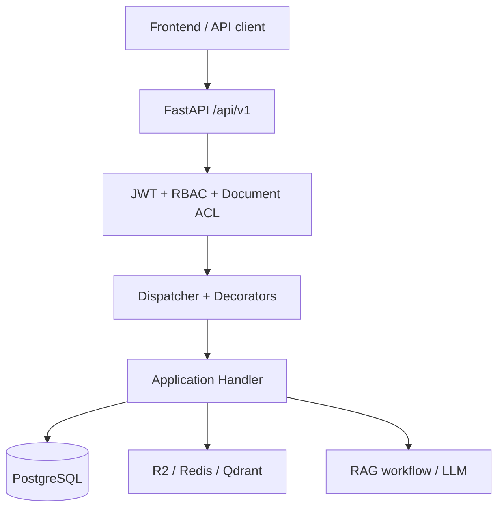
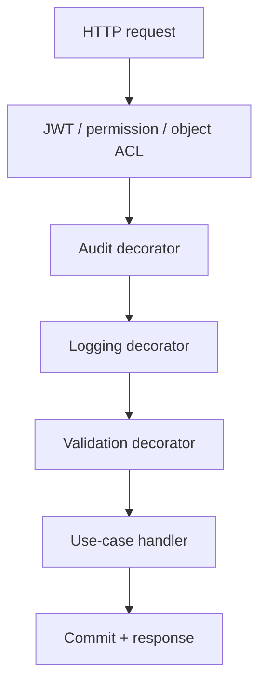
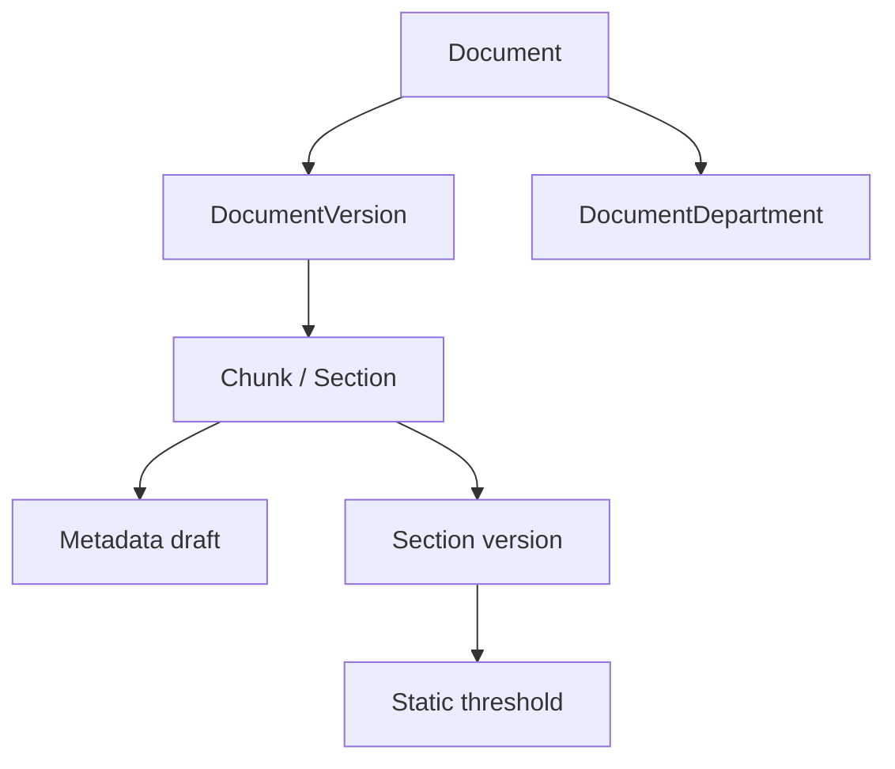
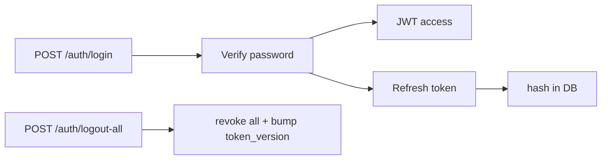
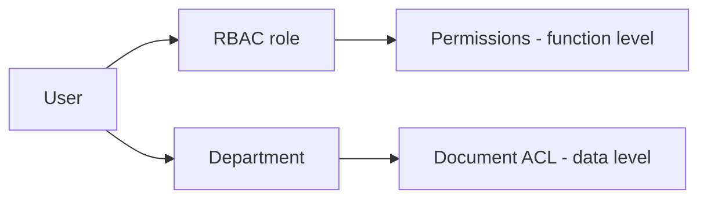
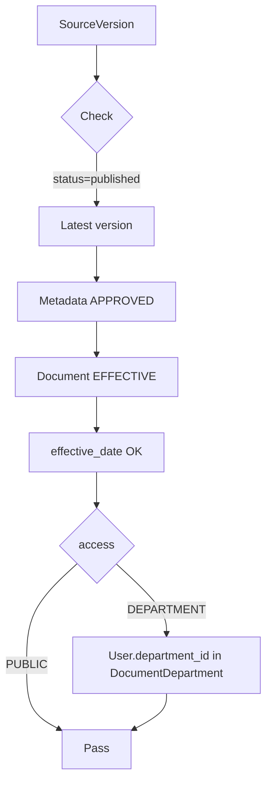
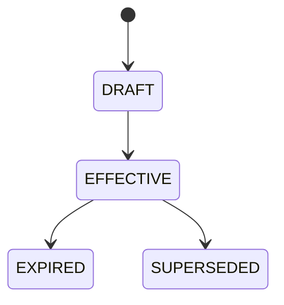
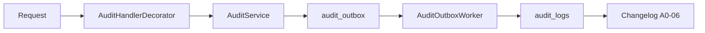
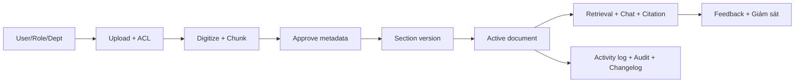

# P-234 Backend v20 — Cách thức hoạt động

> Mô tả backend tại commit v20. Toàn bộ luồng bên dưới mô tả theo code hiện tại.

## 0. Hai hạng mục đang chủ động bỏ qua

1. **Chưa chống brute force cho login** — `POST /api/v1/auth/login` chưa rate limit theo IP/account, chưa tạm khóa sau nhiều lần sai.
2. **Chưa giới hạn dung lượng upload** — `await file.read()` đọc toàn bộ file, chưa giới hạn MB ở API.

Ngoài hai mục này, backend đã đủ luồng cho 21 use case (A0, A, D, F, G, H) gồm giới hạn văn bản `PUBLIC/DEPARTMENT`.

---

## 1. Trách nhiệm của backend

- Xác thực, quản lý phiên đăng nhập, RBAC và Department ACL.
- Quản lý văn bản, version, trạng thái pháp lý, metadata, section version, threshold.
- Số hóa file nguồn thành section/chunk; index vector.
- Lọc candidate trước khi RAG/LLM nhận dữ liệu.
- Lưu session/turn chat, bảo vệ lại history theo quyền hiện hành.
- Ghi nhận feedback và cung cấp dữ liệu giám sát (F-04).
- Activity log, audit outbox, changelog.

**Backend là nguồn quyết định quyền truy cập.** AI không tự quyết user đọc văn bản nào.

---

## 2. Kiến trúc tổng thể



### 2.1 Layer chính

| Thư mục | Trách nhiệm |
|---|---|
| `src/presentation/api` | Router, DTO, auth, ACL, exception mapping. |
| `src/application/features` | Command/query, handler, DTO theo use case. |
| `src/application/common` | Dispatcher, validator, decorator, interface hạ tầng, policy. |
| `src/domain` | Entity, enum, repository protocol. |
| `src/persistence/tenant` | SQLAlchemy model, repository, session, unit of work. |
| `src/infrastructure` | JWT, password, Redis, R2, audit worker, RAG adapter. |
| `src/rag`, `src/retrieval`, `src/services` | AI workflow, embedding, reranker, generator. |
| `migrations_uc` | Alembic migration cho dữ liệu nghiệp vụ. |

### 2.2 Pipeline



`AuditHandlerDecorator` chỉ áp cho command có contract auditable.

---

## 3. Quan hệ dữ liệu chính



- Retrieval mặc định chỉ dùng `version_number` lớn nhất.
- Chunk chỉ vào retrieval khi metadata đã `APPROVED`.
- Section có version: dùng content version hiệu lực tại query date, không fallback raw chunk khi hết hiệu lực.
- Document `DEPARTMENT` ↔ phòng ban qua `document_departments`.

---

## 4. Auth, RBAC và hai lớp quyền

### 4.1 Login + JWT + Refresh + Logout



JWT claims: `sub`, `email`, `role`, `token_version`, `school_id`.

- `role` lấy từ bảng `roles` theo `user_id` — **KHÔNG suy ra từ `school_id`**.
- `school_id` chỉ là tenant context (audit, trace), lấy từ
  `user.department_id`, không từ global `Settings` hoặc user input trực tiếp.

### 4.2 Hai lớp quyền



| Lớp | Quyết định |
|---|---|
| RBAC (function-level) | User có được gọi chức năng không (`document.read`, `document.upload`, `rbac.manage`, ...) |
| Document ACL (data-level) | User đọc được document/section/chunk cụ thể nào (`PUBLIC` hoặc `DEPARTMENT` đúng phòng) |

Có permission nhưng không có ACL → 403. Có ACL nhưng không có permission → 403.

---

## 5. Document ACL — `PUBLIC/DEPARTMENT`

| `access_scope` | Điều kiện đọc |
|---|---|
| `PUBLIC` | User xác thực + có permission tương ứng. Không cần phòng ban. |
| `DEPARTMENT` | User xác thực + permission + thuộc phòng ban active được gán cho document. |

Phạm vi áp dụng: list/detail, source view/download, replace source, digitize, metadata draft/approve/reject, section version, threshold, relation, application scope, changelog, effectiveness alert, retrieval, chat, feedback review.

`GET/PUT /regulatory-documents/{id}/access` yêu cầu `document.update`, admin không bị bắt thuộc ACL hiện tại (tránh tự khóa khi chuyển document).

### Retrieval và chat

Candidate hợp lệ khi đồng thời:



Lỗi fail-closed → 403. RAG/LLM không nhận chunk của văn bản user không có quyền.

### Lịch sử D-04

Khi user hỏi tiếp `session_id`:

1. Lấy tối đa 10 turn gần nhất.
2. Từng turn được kiểm tra lại citation theo phòng ban hiện hành.
3. Citation rỗng/sai/thiếu/trỏ document hết quyền → fail closed.
4. Chỉ turn còn quyền đưa vào bộ nhớ prompt có giới hạn (tối đa 4 turn/2400 ký tự).
5. Retrieval chỉ nhận chủ đề user gần nhất và document number đã cite khi câu hiỏi có dấu hiệu hỏi tiếp; không nhồi toàn bộ answer cũ vào query.
6. Lịch sử chỉ dùng phân giải tham chiếu; evidence mới truy xuất là căn cứ duy nhất của câu trả lời.

Đổi phòng ban hoặc document đổi ACL có hiệu lực ngay cả với history đã lưu.

---

## 6. Vòng đời văn bản

### 6.1 Trạng thái pháp lý document



Không cho chuyển ngược `EXPIRED` / `SUPERSEDED` về hiệu lực bằng update thường.

### 6.2 Trạng thái số hóa source version

```text
RECEIVED → PARSED → INDEXED | FAILED
```

Digitize dùng row lock trên source version.

### 6.3 Replace source

- Tạo `DocumentVersion` mới, giữ version c� cho truy vết.
- `replaces_version_id` trỏ version trước.
- Retrieval mặc định dùng version lớn nhất.
- Chunk version cũ không còn candidate mặc định.

---

## 7. Toàn bộ use case backend (21 UC)

| UC | Mô tả | API chính |
|---|---|---|
| A0-01 | Danh sách/chi tiết/cập nhật metadata, trạng thái pháp lý, kiểm tra trùng mã hiệu. | `GET/PUT /regulatory-documents...` |
| A0-02 | Upload, replace source, tải/xem file. | `POST /regulatory-documents/upload`, `GET/PUT /{id}/source` |
| A0-03 | Quan hệ `amends`, `supersedes`, `references`. | `/regulatory-documents/{id}/relations` |
| A0-04 | Alert, lọc, cập nhật, document đến hạn. | `/document-effectiveness-alerts` |
| A0-05 | Application scope/cross-reference. | `/regulatory-documents/{id}/application-scopes` |
| A0-06 | Changelog document. | `/regulatory-documents/{id}/changelog...` |
| A-01 | Digitize/OCR, section/chunk, index vector. | `POST .../digitize`, `GET .../digitization` |
| A-02 | Extract metadata draft. | `POST .../document-section-metadata/.../extract` |
| A-03 | Approve/reject metadata draft. | `GET .../pending`, `PUT .../drafts/{id}/approve|reject` |
| A-04 | Section version + khoảng hiệu lực. | `/document-sections/{id}/versions...` |
| A-05 | Threshold draft, verify, history. | `/static-thresholds` |
| A-06 | Hybrid retrieval + rerank. | `POST /retrieval/search` |
| D-01 | RAG chat có citation. | `POST /chat` |
| D-04 | Hỏi tiếp `session_id`, tái kiểm ACL. | `POST /chat` |
| F-04 | Review feedback, summary. | `/system-evaluation` |
| G-01 | CRUD + khóa user. | `/users` |
| G-02 | CRUD role. | `/roles` |
| G-03 | Permission, gán role/permission. | `/rbac` |
| G-04 | Login, refresh rotation, logout. | `/auth` |
| G-05 | Activity log. | `/activity-logs` |
| H-08 | Report turn sai. | `POST /chat/turns/{turn_id}/report` |

ACL h� trợ:

| Chức năng | API |
|---|---|
| Danh sách/tạo phòng ban | `GET/POST /departments` |
| Xem ACL document | `GET /regulatory-documents/{id}/access` |
| Đổi `PUBLIC/DEPARTMENT` + phòng ban | `PUT /regulatory-documents/{id}/access` |

---

## 8. Transaction, activity log, audit, exception

### 8.1 Unit of Work

- `flush()` đẩy xuống transaction, chưa commit.
- `save_changes()` commit.
- `rollback()` hủy transaction treo.
- Row lock cho refresh rotation, source version, section version.

### 8.2 Activity log

`LoggingHandlerDecorator` ghi: command name, status, thời gian, user, school, trace ID, IP, device, user agent, error message khi lỗi.

Lỗi activity log không che exception business, không biến business thành 500.

### 8.3 Audit outbox



Audit lỗi không đổi response business thành 500.

### 8.4 Exception

| Exception | HTTP |
|---|---|
| NotFound | 404 |
| Conflict | 409 |
| Forbidden | 403 |
| Unauthorized | 401 |
| Validation | 422 |
| Unknown | 500 (message chung, chi tiết trong server log) |

---

## 9. Rate limit (Redis + Lua)

| Chức năng | Giới hạn | Khóa |
|---|---:|---|
| Refresh | 30 req/IP/60s | `rate:refresh:{ip}` |
| Hybrid search | 60 req/user/60s | `rate:search:{user_id}` |
| Digitize | 10 req/user/300s | `rate:digitize:{user_id}` |
| Replace source | 10 req/user/300s | `rate:replace-source:{user_id}` |
| Chat | 10 req/user/60s (cấu hình được) | `chat-rate:{user_id}` |
| Chat đồng th�i | 1 chat/user, lock 180s | `chat-running:{user_id}` |

Login không rate limit (nằm trong mục chủ động bỏ qua).

---

## 10. Tình huống thực tế

> Tên văn bản và giá trị minh họa — không phải quy định thật.

### 10.1 Bối cảnh

- 2 phòng ban: `TC-KT` (Tài chính – Kế toán), `DAO-TAO` (Đào tạo).
- 4 user:
  - **An** (admin, role ADMIN, không thuộc phòng ban).
  - **Bình** (thuộc `TC-KT`, LECTURER, có quyền upload/process/approve).
  - **Chi** (thuộc `TC-KT`, LECTURER, chỉ đọc/search/chat).
  - **D�ng** (thuộc `DAO-TAO`, LECTURER, đọc/search/chat nhưng không đọc được tài liệu nội bộ TC-KT).
- Văn bản: `HD-12/2026/TC-KT`, scope `DEPARTMENT`, có ngưỡng "200 giờ/năm".

### 10.2 Chuẩn bị

Admin An:

1. Tạo 2 department qua `/departments`.
2. Tạo user, gán `department_id`.
3. Tạo role qua `/roles`.
4. Gán permission cho role, gán role cho user qua `/rbac`.

### 10.3 Upload + ACL

```text
POST /regulatory-documents/upload
  document_number=HD-12/2026/TC-KT
  title=Hư�ng dẫn thanh toán giờ giảng vượt định mức
  issued_by=Trường Đại học Minh họa
  issued_date=2026-08-01
  effective_date=2026-09-01
  file=hd-12-2026.pdf
```

Backend tạo document ở `RECEIVED`, source version 1, upload R2, ghi audit/activity.

Đổi sang `DEPARTMENT`:

```text
PUT /regulatory-documents/{id}/access
  access_scope=DEPARTMENT
  department_ids=[TC-KT]
```

Backend thực hiện 3 phase:

1. **Phase 1 — Neon**: cập nhật `documents.access_scope`,
   `document_departments`, `document_chunks.metadata`, commit.
2. **Phase 2 — R2 mirror** (mới): với mỗi `document_version`,
   tính canonical key mới dựa trên `access_scope` mới qua
   `ObjectKeyBuilder`. Nếu key mới ≠ key cũ:
   - Pre-flight: kiểm tra old key tồn tại, new key chưa tồn tại.
   - Server-side copy old → new (không download).
   - Cập nhật `document_versions.object_key` trong DB.
   - Old key cũ giữ nguyên — `sweep_r2_orphans.py` dọn sau.
3. **Phase 3 — Qdrant**: cập nhật payload (`tenant_id`, `allowed_units`,
   `classification`, `owner_unit`) qua `set_payload` filtered theo
   `document_id`.

Sau bước này: Chi đọc được, Dũng `403`, user không thuộc phòng ban cũng `403`.

### 10.4 Digitize

```text
POST /regulatory-documents/{id}/versions/{version_id}/digitize
```

Backend: check permission + ACL, lock version, chuyển `PARSED`, OCR/parse, lưu section/chunk, index vector, chuyển `INDEXED` (hoặc `FAILED`).

### 10.5 Metadata + section version + threshold

1. Extract metadata draft.
2. Bình duyệt pending.
3. Đối chiếu PDF nguồn, approve/reject từng draft.
4. Tạo section version `effective_from=2026-09-01`.
5. Tạo threshold "200 giờ/năm" gắn section.
6. Verify threshold sau khi metadata approve.

Threshold c� cùng key chỉ thay current khi xác nhận thay thế. Lịch sử giữ nguyên.

### 10.6 Đưa document vào sử dụng

```text
PUT /regulatory-documents/{id}
  legal_status=EFFECTIVE
```

Từ `effective_date`, chunk đã approve của document mới đủ điều kiện retrieval.

### 10.7 So sánh quyền search/chat

- **Chi** (TC-KT): search/chat trả chunk/citation đúng document.
- **Dũng** (DAO-TAO): PostgreSQL loại mọi chunk của `HD-12/2026/TC-KT` trước retrieval; nếu không còn document PUBLIC nào, hệ thống trả "không đủ căn cứ" thay vì suy diễn.
- **PUBLIC document**: ai có `document.read` đều đọc được.

### 10.8 Hỏi sâu D-04

Chi hỏi tiếp với `session_id`. Nếu Chi chuyển khỏi `TC-KT`, turn cũ trỏ TC-KT bị loại khỏi history, nội dung cũ không đưa lại vào prompt.

### 10.9 Báo sai + giám sát

```text
POST /chat/turns/{turn_id}/report
```

Feedback gắn với turn, không sửa answer cũ. Admin mở `/system-evaluation/flagged-answers` — backend kiểm ACL trước khi tính total và pagination.

### 10.10 Replace source

1. PUT source mới → tạo version 2, không ghi đè version 1.
2. Version 2 digitize + approve lại.
3. Retrieval chọn version 2.
4. Audit/changelog giữ lịch sử.

---

## 11. Khởi động

### 11.1 Dịch vụ cần

- PostgreSQL/Neon (nghiệp vụ).
- Redis (token-version, rate limit, chat lock).
- Cloudflare R2 (file).
- Qdrant hoặc memory vector backend.
- LLM/embedding provider.

### 11.2 Biến môi trường chính

```text
APP_ENV, APP_HOST, APP_PORT, CORS_ORIGINS, LOG_LEVEL, DEV_AUTH_BYPASS
DATABASE_URL                 (chia sẻ backend + RAG, schema public + rag_legacy)
REDIS_URL
R2_ENDPOINT, R2_ACCESS_KEY_ID, R2_SECRET_ACCESS_KEY, R2_BUCKET_NAME
JWT_ISSUER, JWT_AUDIENCE, JWT_SECRET_KEY
JWT_ACCESS_TOKEN_MINUTES, JWT_REFRESH_TOKEN_DAYS
OPENAI_API_KEY, MODEL_NAME, LLM_TEMPERATURE
VECTOR_BACKEND, QDRANT_URL, QDRANT_API_KEY, QDRANT_COLLECTION
GENERATOR_PROVIDER, EMBEDDING_PROVIDER, ...
EVIDENCE_SUFFICIENT_TOP_SCORE, EVIDENCE_PARTIAL_TOP_SCORE
```

> `school_id` / `school_code` **không có trong env**. Tenant context xác thực
> được suy ra từ `user.department_id` / `department.code`; các field legacy
> tương ứng trong [src/config.py](src/config.py) mặc định là `None` để phát hiện
> consumer cũ còn sót.
>
> Nếu credential từng commit Git, xóa khỏi file chưa đủ — phải rotate.

### 11.3 Migration

```powershell
$env:PYTHONPATH = "$PWD\src"
alembic -c alembic_uc.ini upgrade head
```

Head v20: `c91a7e4f2b60`.

### 11.4 Chạy API

```powershell
$env:PYTHONPATH = "$PWD\src"
python -m uvicorn src.main:app --reload --host 127.0.0.1 --port 8000
```

- Health: `GET http://127.0.0.1:8000/health`
- Swagger: `http://127.0.0.1:8000/docs`

---

## 12. Checklist test end-to-end

### 12.1 Auth/RBAC

- Login đúng/sai, account inactive.
- Refresh rotation: hai refresh đồng th�i cùng token chỉ một thành công.
- Logout + logout-all làm token cũ mất hiệu lực.
- User thiếu permission → 403.

### 12.2 Document ACL

- User đúng phòng đọc document `DEPARTMENT`.
- User khác phòng / không phòng / phòng inactive → 403.
- Mọi user có permission đọc được document `PUBLIC`.
- Nhất quán tại list/detail/source/metadata/section version/threshold/alert/retrieval/chat/feedback review.

### 12.3 Lifecycle/RAG

- Upload → access → digitize → approve → section version → active → search → chat.
- Replace source tạo version mới; retrieval không dùng version cũ.
- Section có version hết hiệu lực không fallback raw chunk.
- Document chưa `EFFECTIVE` không vào retrieval.
- Metadata chưa approve không vào retrieval.

### 12.4 D-04 / F-04 / H-08

- Hỏi tiếp giữ ngữ cảnh.
- Đổi phòng ban/ACL làm history cũ lọc lại.
- Citation rỗng/sai → fail closed.
- Feedback list lọc ACL trước pagination + total.
- User chỉ report turn của mình; reviewer phải có quyền với document nguồn.

### 12.5 Transaction / audit

- Request thất bại sau `flush()` không commit business.
- Activity log lỗi không che lỗi business.
- Audit lỗi không biến business thành 500.
- Audit outbox → audit log → changelog.

### 12.6 Chưa pass (theo mục 0)

- Login brute force chưa rate limit/khóa.
- Upload file rất lớn chưa chặn theo dung lượng API.

---

## 13. Kết luận

Backend v20 theo Clean Architecture với custom pipeline. PostgreSQL là nguồn dữ liệu và nguồn quyết định quyền. RAG/LLM chỉ nhận candidate đã qua permission + document ACL + legal status + source version + metadata approval + section effectiveness.

Luồng trung tâm:



Hai khoảng trống còn lại cần đưa vào checklist trư�c khi phát hành production: **brute-force protection cho login** và **giới hạn dung lượng upload**.
