# P-234 Backend — Luồng A0-01 → A0-06 cho FE

> Hướng dẫn dành cho Frontend. Mô tả hành vi Backend hiện tại (đã PASS API test).

## 1. Tổng quan 6 UC

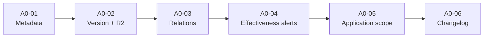

Audit pipeline (cho A0-06):

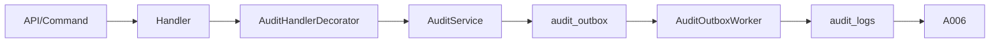

FE không truy cập trực tiếp DB/R2; chỉ làm việc qua API và giữ đúng ID BE trả về.

---

## 2. A0-01 — Quản lý thông tin văn bản

Quản lý metadata: `document_number`, `title`, `issued_by`, `issued_date`, `effective_date`, `legal_status`.

```text
Document != file PDF
```

Document là đối tượng nghiệp vụ; file nguồn/version ở A0-02.

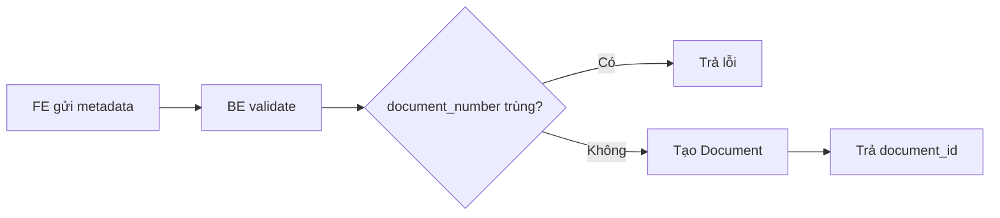

- `document_id` là ID chính dùng xuyên suốt các UC sau.
- DB có unique index theo `lower(document_number)` (case-insensitive). FE nên hiển thị conflict từ BE thay vì tự validate client.
- Update metadata không upload/thay PDF.

---

## 3. A0-02 — Nạp / thay thế file nguồn

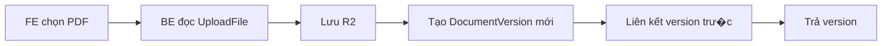

```text
Document D1
├── Version V1
└── Version V2
```

Replace giữ nguyên `document_id`, tăng `version_number`.

Endpoint: `PUT /api/v1/regulatory-documents/{document_id}/source` — `multipart/form-data` field `file`.

Scope A0-05 không tự chuyển sang version mới; scope cũ vẫn gắn `source_version_id = V1`.

---

## 4. A0-03 — Quan hệ giữa các văn bản

```json
{
  "target_document_id": "...",
  "relation_type": "supersedes|amends|references",
  "note": "...",
  "confirm_conflict": false
}
```

- `supersedes` — thay thế.
- `amends` — sửa đổi/bổ sung, không thay thế.
- `confirm_conflict` chỉ gửi `true` khi BE phát hiện conflict.

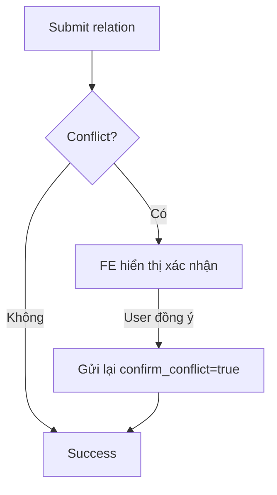

---

## 5. A0-04 — Hiệu lực và cảnh báo

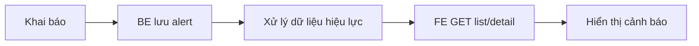

`effective_date_reached` là giá trị BE tính trong response, **không phải column trong DB**.

FE không tự suy luận `effective_date_reached = true → đổi document.status`. Việc chuyển trạng thái theo API/UC riêng.

---

## 6. A0-05 — Phạm vi áp dụng

```text
source_document_id
source_version_id
related_document_id
scope_type           # whole_document | specific_content
scope_detail         # null nếu whole_document, "Điều 5, Khoản 2" nếu specific_content
reference_nature     # mandatory | reference
```

Binding theo version — BE giữ lịch sử:

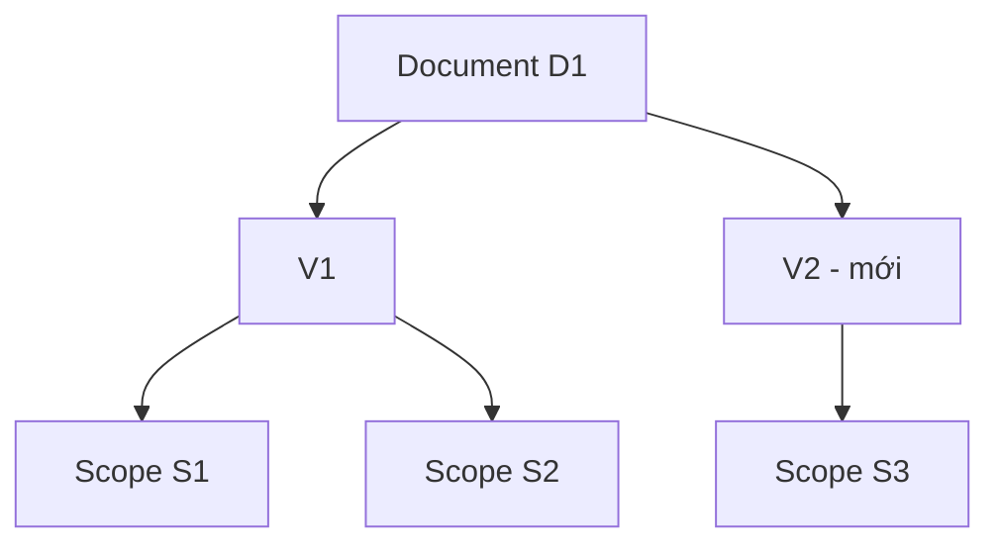

---

## 7. A0-06 — Lịch sử thay đổi

Reuse audit infrastructure:

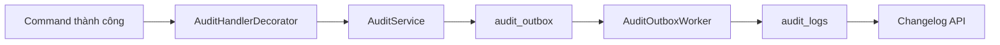

```http
GET /api/v1/regulatory-documents/{document_id}/changelog?action=...&from_at=...&to_at=...&page=1&page_size=20
GET /api/v1/regulatory-documents/{document_id}/changelog/{changelog_id}
```

Filter thời gian:

```text
created_at >= from_at AND created_at <= to_at
```

Pagination: `page >= 1`, `1 <= page_size <= 100`, `total` tổng record thỏa filter.

Changelog **read-only**. FE không POST/PUT/PATCH/DELETE.

---

## 8. Quan hệ giữa 6 UC

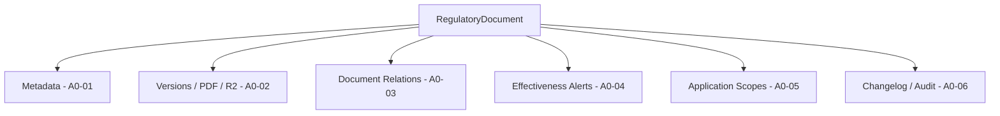

---

## 9. Gợi ý mapping màn hình FE

| Tab | UC |
|---|---|
| Thông tin | A0-01 |
| File & phiên bản | A0-02 |
| Quan hệ văn bản | A0-03 |
| Hiệu lực & cảnh báo | A0-04 |
| Phạm vi áp dụng | A0-05 |
| Lịch sử thay đổi | A0-06 |

BE không bắt buộc layout này — chỉ là gợi ý.

---

## 10. ID FE phải phân biệt

| ID | Ý nghĩa |
|---|---|
| `document_id` | ID văn bản nghiệp vụ |
| `version_id` / `source_version_id` | ID phiên bản file nguồn |
| `target_document_id` | Document đích của A0-03 |
| `related_document_id` | Document viện dẫn � A0-05 |
| `scope_id` | ID phạm vi áp dụng |
| `changelog_id` | ID audit/changelog |
| `actor_id` | Người thực hiện |

Không dùng `version_id` thay `document_id`.

---

## 11. Business rule FE không tự làm

FE không tự:

- Quyết uniqueness `document_number`.
- Quyết supersession/relation conflict.
- Luôn gửi `confirm_conflict=true`.
- Tăng `version_number`.
- Chuyển scope cũ sang version mới.
- Đổi document.status khi tới `effective_date`.
- Tạo/sửa/xóa changelog.

Luồng đúng:

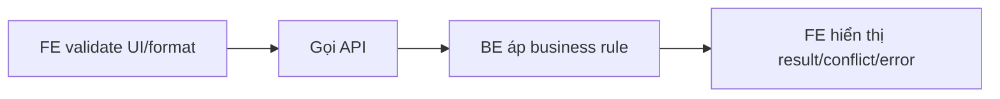

---

## 12. Luồng tích hợp FE minh họa

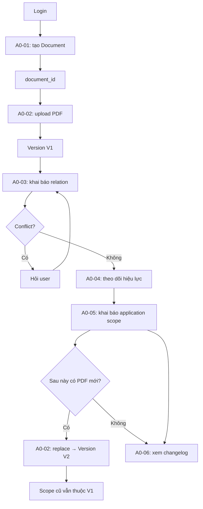

---

## 13. Trạng thái Backend hiện tại

```text
A0-01 PASS
A0-02 PASS
A0-03 PASS
A0-04 PASS
A0-05 PASS
A0-06 PASS
```

Cả 6 UC đã được test trực tiếp qua API. Audit pipeline A0-06 hoạt động đầy đủ (Decorator → Service → outbox → Worker → logs → API).

FE có thể tích hợp dựa trên API/contract hiện tại mà không cần truy cập trực tiếp DB hoặc R2.
