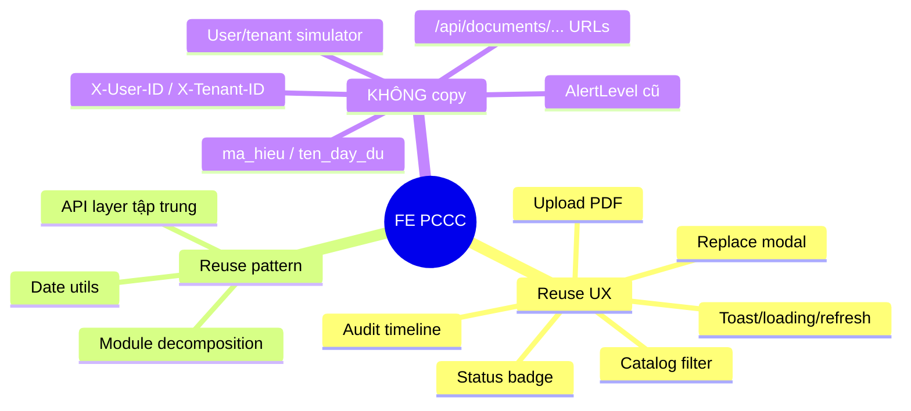
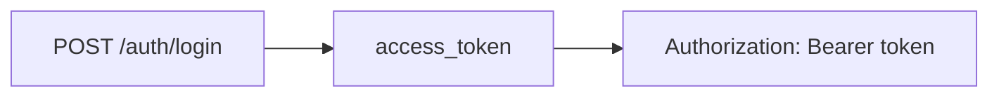
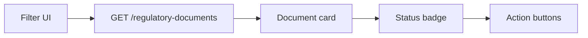
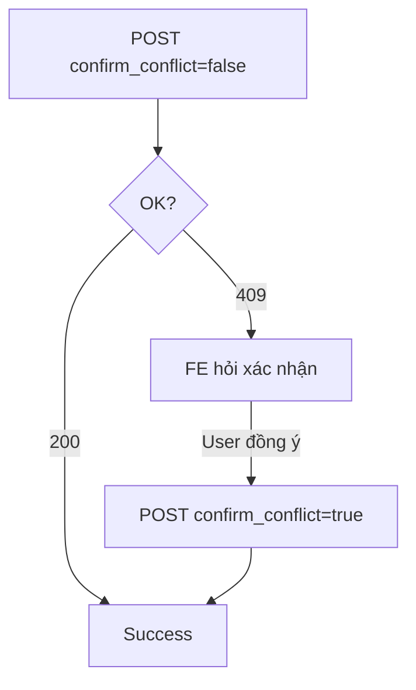
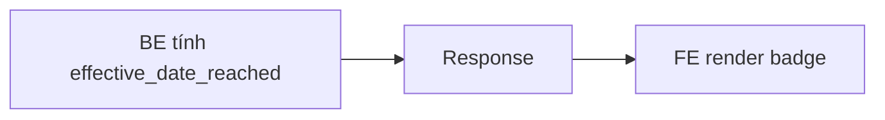
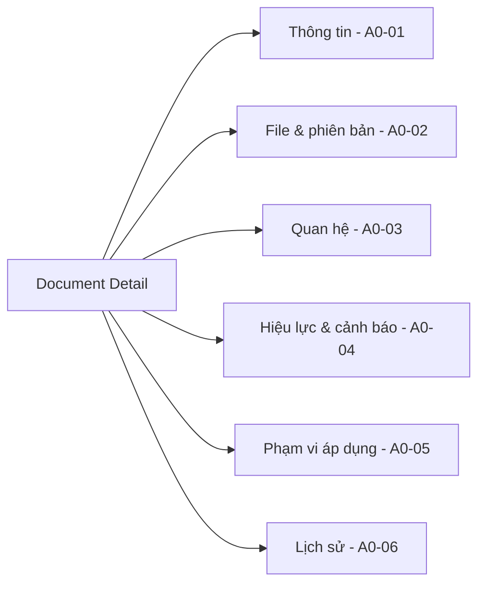
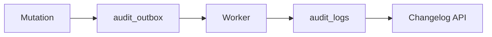

# P-234 FE — Hướng dẫn tận dụng FE PCCC làm tham khảo

> Phần nào của FE PCCC có thể tận dụng, phần nào chỉ lấy ý tưởng, phần nào **không copy nguyên**.

---

## 1. Kết luận ngắn

FE PCCC rất đáng tham khảo cho FE P-234, đặc biệt:



Lý do:

```text
PCCC FE: Vite + TypeScript, dùng simulated user/tenant, gửi X-User-ID / X-Tenant-ID.
P-234 BE: JWT Bearer, /api/v1/..., contract mới (document_number, source_version_id, ...).
```

---

## 2. Ma trận reuse

| Module PCCC | Mức reuse | Cách dùng cho P-234 |
|---|---|---|
| `catalog.ts` | Rất cao | Lấy flow list/filter/status/card/action |
| `upload.ts` | Cao | Lấy UX chọn PDF, FormData, loading, toast |
| `modal.ts` | Cao | Lấy UX replace source bằng modal |
| `audit.ts` | Cao | Lấy cách render timeline/action badge |
| `api.ts` | Trung bình | Chỉ lấy pattern gom fetch; phải viết lại URL/header/body |
| `types.ts` | Trung bình thấp | Hiểu domain cũ; thay bằng contract P-234 |
| `state.ts` | Thấp | Không reuse simulated tenant/user headers |
| `index.html` | Cao | Dùng bố cục/form/filter/list/modal làm mockup |

---

## 3. Phần KHÔNG copy: authentication

PCCC tạo headers:

```ts
{ 'X-User-ID': currentUser.id, 'X-Tenant-ID': activeTenant.id }
```

P-234 dùng JWT Bearer:



```ts
function getAuthHeaders(): HeadersInit {
  const token = authStore.getAccessToken();
  return {
    Authorization: `Bearer ${token}`,
    Accept: 'application/json',
  };
}
```

Không gửi `X-User-ID` / `X-Tenant-ID` để giả mạo actor. Actor/audit do BE xác định t� token.

---

## 4. Cấu trúc component gợi ý cho P-234

```text
features/
└── regulatory-documents/
    ├── api/
    ├── types/
    ├── pages/ (DocumentListPage, DocumentDetailPage)
    ├── components/
    │   ├── DocumentFilters
    │   ├── DocumentCard
    │   ├── UploadSourceDialog
    │   ├── ReplaceSourceDialog
    │   ├── RelationsTab
    │   ├── EffectivenessAlertsTab
    │   ├── ApplicationScopesTab
    │   └── ChangelogTab
    └── hooks/
```

---

## 5. A0-01 — Catalog



Field map PCCC → P-234:

```ts
interface RegulatoryDocument {
  id: string;
  document_number: string;  // ma_hieu → document_number
  title: string;             // ten_day_du → title
  issued_by: string | null;
  issued_date: string | null;
  effective_date: string | null;
  legal_status: string;
}
```

Status badge dùng đúng giá trị BE P-234 trả: `DRAFT`, `SUPERSEDED`, `EFFECTIVE`, ...

---

## 6. A0-02 — Upload + Replace

Upload P-234 đã tách rõ:

```text
A0-01 → document metadata
A0-02 → source/version
```

Replace source:

```http
PUT /api/v1/regulatory-documents/{document_id}/source
```

Request: `multipart/form-data` field `file`. **Không set `Content-Type` thủ công** — browser tự gắn boundary.

```ts
export async function replaceDocumentSource(
  documentId: string,
  file: File,
) {
  const form = new FormData();
  form.append('file', file);
  return apiFetch(`/api/v1/regulatory-documents/${documentId}/source`, {
    method: 'PUT',
    body: form,
  });
}
```

UX reuse: drag/drop, file name, file size, loading button, toast, refresh sau success.

---

## 7. A0-03 — Quan hệ văn bản + Conflict

```ts
type RelationType = 'supersedes' | 'amends' | 'references';

interface RelationInput {
  target_document_id: string;
  relation_type: RelationType;
  note?: string;
  confirm_conflict?: boolean;
}
```

Conflict flow:



Không mặc định `confirm_conflict=true`.

---

## 8. A0-04 — Hiệu lực & cảnh báo

`effective_date_reached` là field BE tính trong response, không phải column DB.



FE không tự:

```ts
if (effectiveDate <= today) document.status = 'HIEU_LUC';  // ❌
```

Document status phải theo BE.

---

## 9. A0-05 — Application scope

```ts
type ApplicationScopeType = 'whole_document' | 'specific_content';
type ReferenceNature = 'mandatory' | 'reference';

interface DocumentApplicationScope {
  id: string;
  source_document_id: string;
  source_version_id: string;
  related_document_id: string;
  scope_type: ApplicationScopeType;
  scope_detail: string | null;
  reference_nature: ReferenceNature;
  created_by: string | null;
  created_at: string;
}
```

Binding theo `source_version_id` — giữ phân biệt giữa các version, không merge scope.

---

## 10. A0-06 — Changelog

API mới (khác PCCC):

```http
GET /api/v1/regulatory-documents/{document_id}/changelog
GET /api/v1/regulatory-documents/{document_id}/changelog/{changelog_id}
```

```ts
interface ChangelogQuery {
  action?: string;
  from_at?: string;
  to_at?: string;
  page?: number;
  page_size?: number;
}
```

UI gợi ý: tab Lịch sử trong Document Detail.



Action badge unknown → hiển thị raw (không crash).

---

## 11. Audit worker bất đồng bộ



Mutation thành công → FE GET changelog ngay có thể **chưa thấy event mới** vài giây đầu. Không coi đó là mutation thất bại. Có thể refresh sau vài giây hoặc để user bấm refresh.

---

## 12. Error handling

```text
401 → session/auth flow
403 → không có quyền
404 → resource không tồn tại
409 → business conflict (A0-03 có confirm dialog)
422 → map field error
500 → generic server error
```

Không gộp mọi lỗi vào một toast.

---

## 13. Refresh sau mutation

```text
Update metadata       → refresh document detail, invalidate changelog
Replace source        → refresh version list, invalidate changelog
Create relation       → refresh relations, invalidate changelog
Create alert          → refresh alert list, invalidate changelog
Create scope          → refresh scope list, invalidate changelog
```

Nếu dùng React Query/TanStack: `invalidateQueries(...)` phù hợp hơn fetch thủ công.

---

## 14. RBAC identity — không hard-code role PCCC

PCCC render button theo role `THAM_TRA_VIEN` / `CHUYEN_GIA_PHE_DUYET` / `ADMIN`.

P-234 phân quyền theo RBAC identity (ADMIN/LECTURER/LEADER/REVIEWER) qua **permission**, không phải role string:

```ts
if (can('document.upload')) showReplaceSourceButton();
```

BE vẫn là lớp authorization cuối cùng — FE ẩn button không có nghĩa bypass được.

---

## 15. API client wrapper

```ts
export class ApiError extends Error {
  constructor(public status: number, public body: unknown, message: string) {
    super(message);
  }
}

export async function apiFetch<T>(path: string, options: RequestInit = {}): Promise<T> {
  const token = authStore.getAccessToken();
  const headers = new Headers(options.headers);
  headers.set('Accept', 'application/json');
  if (token) headers.set('Authorization', `Bearer ${token}`);

  const response = await fetch(path, { ...options, headers });
  if (!response.ok) {
    let body: unknown = null;
    try { body = await response.json(); } catch {}
    throw new ApiError(response.status, body, `API request failed: ${response.status}`);
  }
  if (response.status === 204) return undefined as T;
  return response.json() as Promise<T>;
}
```

---

## 16. Checklist trước khi port 1 màn hình

```text
[ ] UI còn đúng với P-234?
[ ] Endpoint P-234 là gì?
[ ] Request JSON hay multipart?
[ ] Field name P-234?
[ ] Response shape?
[ ] Status/enum hiện tại?
[ ] Auth Bearer đã dùng?
[ ] Permission nào điều khiển action?
[ ] Có 409 business conflict?
[ ] Mutation có audit async?
[ ] Có gắn document_id / version_id?
```

---

## 17. Tổng hợp mức reuse

```mermaid
flowchart TB
    R1[Reuse ý tưởng gần như trực tiếp] --> A1[Filter panel]
    R1 --> A2[Document card/table]
    R1 --> A3[Status badges]
    R1 --> A4[Upload selector + drag/drop]
    R1 --> A5[Replace modal]
    R1 --> A6[Audit timeline]
    R1 --> A7[Toast/loading/empty/error state]

    R2[Port/refactor] --> B1[API client]
    R2 --> B2[Domain types]
    R2 --> B3[Date utils]
    R2 --> B4[Permission-based visibility]
    R2 --> B5[Refresh-after-mutation]

    R3[KHÔNG copy nguyên] --> C1[X-User-ID / X-Tenant-ID]
    R3 --> C2[User/tenant simulator]
    R3 --> C3[/api/documents/... URLs]
    R3 --> C4[ma_hieu / ten_day_du]
    R3 --> C5[AlertLevel cũ]
    R3 --> C6[Relation enums cũ]
```

---

## 18. Quy tắc ưu tiên khi mâu thu�n

```text
1. Swagger/OpenAPI P-234 đang chạy
2. `BACKEND_FLOW_A0.md`
3. `USE_CASES.md`
4. FE/UC PCCC chỉ làm reference
```

Tóm lại:

```text
PCCC cho FE biết: nên thiết kế trải nghiệm thế nào
P-234 BE cho FE biết: phải gửi gì, nhận gì và business rule hiện tại là gì
```
