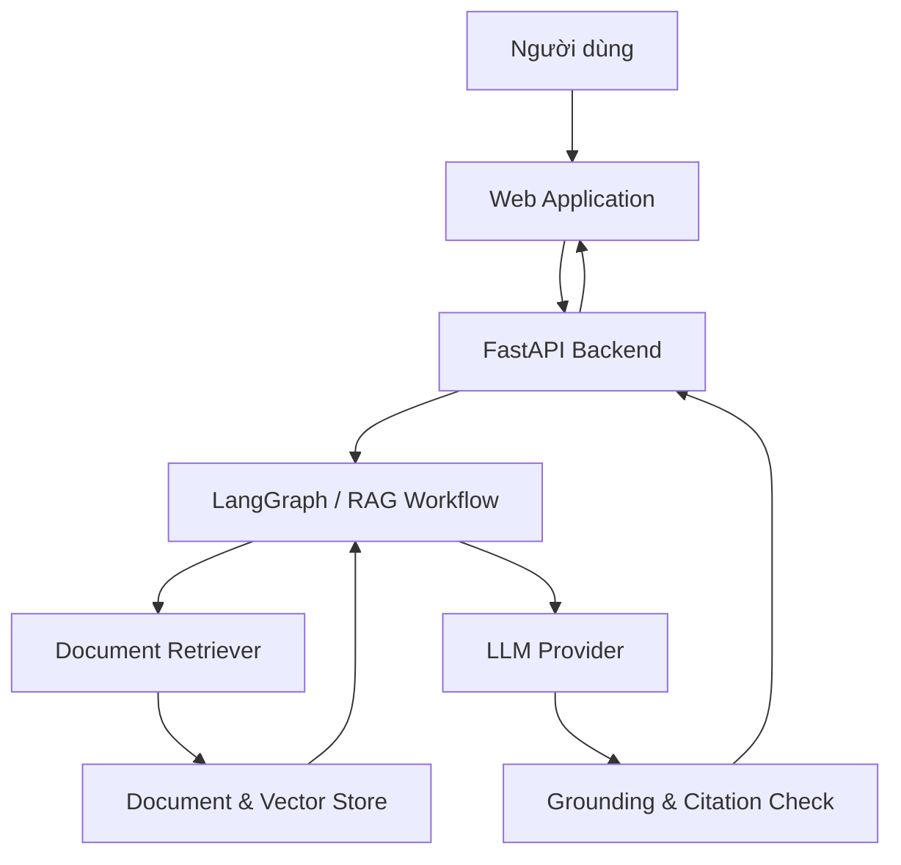

# PolicyMeta AI

> **Trợ lý ảo tra cứu quy định, quy chế nội bộ có trích dẫn chính xác dành cho lãnh đạo, cán bộ và giảng viên.**

## Tổng quan

PolicyMeta AI hỗ trợ người dùng tìm kiếm và khai thác kho văn bản quy định, quy chế nội bộ của trường đại học bằng ngôn ngữ tự nhiên.

Hệ thống được định hướng xây dựng theo kiến trúc **Retrieval-Augmented Generation (RAG)**: truy xuất các nội dung liên quan từ kho tài liệu trước, sau đó sử dụng mô hình ngôn ngữ để tổng hợp câu trả lời dựa trên nguồn đã tìm thấy.

Mỗi câu trả lời cần:

- Bám sát nội dung văn bản nội bộ được cung cấp.
- Trích dẫn rõ văn bản, điều, khoản hoặc đoạn liên quan.
- Ưu tiên phiên bản còn hiệu lực hoặc mới nhất khi có nhiều phiên bản.
- Hạn chế suy diễn khi tài liệu không đủ căn cứ.


## Vấn đề

Lãnh đạo, cán bộ và giảng viên thường mất nhiều thời gian để tìm đúng quy định hoặc quy chế trong kho tài liệu nội bộ lớn. Một số khó khăn chính gồm:

- Tài liệu nằm phân tán hoặc khó tìm bằng từ khóa chính xác.
- Một quy định có thể tồn tại nhiều phiên bản, dẫn đến nguy cơ sử dụng nhầm văn bản cũ.
- Người dùng phải đọc nhiều tài liệu dài để tìm một điều khoản cụ thể.
- Việc kiểm tra nguồn và đối chiếu nội dung trả lời tốn thời gian.


## Giải pháp

PolicyMeta AI cung cấp giao diện hỏi đáp để người dùng đặt câu hỏi bằng ngôn ngữ tự nhiên. Hệ thống sẽ tìm kiếm nội dung liên quan, tổng hợp câu trả lời và trả về trích dẫn để người dùng kiểm chứng.

### Phạm vi MVP

- Tiếp nhận và lập chỉ mục tài liệu quy định, quy chế.
- Tìm kiếm nội dung liên quan theo câu hỏi của người dùng.
- Trả lời dựa trên dữ liệu đã truy xuất.
- Hiển thị nguồn trích dẫn tương ứng với câu trả lời.
- Hỗ trợ nhận diện và ưu tiên phiên bản tài liệu phù hợp.
- Ghi nhận phản hồi để phục vụ đánh giá chất lượng hệ thống.


### Hướng phát triển

- Nhắc việc dựa trên quy định và mốc thời gian liên quan.
- Hỗ trợ tạo báo cáo hoặc biểu mẫu nghiệp vụ.
- Hỗ trợ các tác vụ chuyên môn có căn cứ từ văn bản nội bộ.
- Phân quyền truy cập theo nhóm người dùng và phạm vi tài liệu.


## Mục tiêu

- Đạt độ chính xác mục tiêu trên **85%** trong tập câu hỏi đánh giá của dự án.
- Giảm thời gian tìm kiếm thông tin trong kho quy định, quy chế.
- Giảm nguy cơ áp dụng nhầm phiên bản văn bản.
- Giúp người dùng kiểm chứng nhanh câu trả lời thông qua trích dẫn.


## Đối tượng sử dụng


| Nhóm người dùng   | Nhu cầu chính                                                           |
| ----------------- | ----------------------------------------------------------------------- |
| Lãnh đạo          | Tra cứu nhanh căn cứ để hỗ trợ ra quyết định và xử lý nghiệp vụ         |
| Cán bộ, nhân viên | Tìm quy trình, biểu mẫu, trách nhiệm và thời hạn thực hiện              |
| Giảng viên        | Tra cứu quy định liên quan đến giảng dạy, nghiên cứu và công tác nội bộ |
| Quản trị viên     | Quản lý nguồn tài liệu, phiên bản và quyền truy cập                     |


## Tình huống sử dụng

Ví dụ câu hỏi hệ thống cần hỗ trợ:

- Quy định hiện hành về nội dung này nằm trong văn bản nào?
- Điều kiện để thực hiện một thủ tục cụ thể là gì?
- Trách nhiệm của đơn vị hoặc cá nhân liên quan được quy định ra sao?
- Văn bản nào thay thế hoặc sửa đổi phiên bản trước?
- Thời hạn xử lý nghiệp vụ được quy định tại điều, khoản nào?


## Kiến trúc tổng quan




Luồng xử lý dự kiến:

1. Người dùng gửi câu hỏi.
2. Hệ thống chuẩn hóa câu hỏi và xác định nhu cầu tra cứu.
3. Retriever tìm các đoạn tài liệu phù hợp.
4. LLM tổng hợp câu trả lời từ ngữ cảnh được cung cấp.
5. Hệ thống kiểm tra nguồn và gắn trích dẫn.
6. Câu trả lời cùng nguồn tham chiếu được trả về giao diện.


## Tech Stack


| Layer                | Technology                                               |
| -------------------- | -------------------------------------------------------- |
| AI Orchestration     | LangGraph                                                |
| LLM                  | Nhà cung cấp có thể cấu hình theo môi trường triển khai  |
| Backend              | FastAPI, Python 3.11+                                    |
| Frontend             | React hoặc Next.js, TypeScript                           |
| Database             | PostgreSQL hoặc SQLite                                   |
| Retrieval            | RAG; vector store được lựa chọn theo thiết kế triển khai |
| DevOps               | Docker, GitHub Actions                                   |
| Testing & Evaluation | Pytest và bộ dữ liệu đánh giá nội bộ                     |


> Một số thành phần công nghệ có thể được điều chỉnh trong quá trình hoàn thiện kiến trúc và triển khai MVP.


## Quick Start


### Yêu cầu

- Python 3.11+
- Git
- Docker và Docker Compose nếu chạy bằng container
- API key của LLM được cấu hình trong `.env`


### Chạy backend cục bộ

```bash
# 1. Clone repository
git clone https://github.com/AI20K-Build-Phase-Cohort-3/P-234.git
cd P-234

# 2. Kích hoạt Python

# 3. Cài đặt dependencies
pip install -r requirements.txt

# 4. Tạo file cấu hình môi trường
cp .env.example .env
# Cập nhật các giá trị cần thiết trong .env

# 5. Khởi động development server
uvicorn src.main:app --reload
```

Sau khi khởi động, kiểm tra health endpoint tại `http://localhost:8000/health`.

### Chạy bằng Docker

```bash
docker compose up --build
```


## Project Structure

```text
src/
├── agents/          # LangGraph agent definitions
├── api/             # FastAPI routes (legacy)
├── application/     # Use-case handlers, dispatcher, decorators
├── domain/          # Entities, enums, repository protocols
├── infrastructure/  # JWT, Redis, R2, audit worker, RAG adapter
├── persistence/     # SQLAlchemy models, repositories, UoW
├── presentation/    # FastAPI routers, DTO, dependencies
├── rag/             # RAG pipeline hiện có
├── ingestion/       # Parse / OCR / chunk
├── retrieval/       # Hybrid retrieval, rerank
├── evaluation/      # Đánh giá RAG
├── guardrails/      # Citation validator
├── security/        # Metadata contract
├── models/          # Pydantic schemas
├── services/        # Business logic
├── config.py
└── main.py
├── tests/               # Unit và integration tests
├── migrations_uc/       # Alembic cho dữ liệu nghiệp vụ
├── docs/                # Tài liệu dự án
├── eval/                # Dataset, script và kết quả đánh giá
├── presentation/        # Demo và pitch materials
├── frontend/            # Next.js
├── Dockerfile
├── docker-compose.yml
└── .github/workflows/
```

> Cấu trúc theo Clean Architecture — chi tiết ở `BACKEND_ARCHITECTURE.md`.


## API Endpoints

Backend P-234 cung cấp hơn 30 endpoint qua `/api/v1`. Đầy đủ xem Swagger tại `/docs`. Một số endpoint chính:


| Method | Path                                  | Mô tả                |
| ------ | ------------------------------------- | -------------------- |
| `GET`  | `/health`                             | Health check         |
| `POST` | `/api/v1/auth/login`                  | Đăng nhập            |
| `POST` | `/api/v1/auth/register`               | Đăng ký              |
| `POST` | `/api/v1/regulatory-documents/upload` | Upload tài liệu      |
| `GET`  | `/api/v1/regulatory-documents`        | Danh sách tài liệu   |
| `POST` | `/api/v1/retrieval/search`            | Hybrid retrieval     |
| `POST` | `/api/v1/chat`                        | Hỏi đáp có trích dẫn |


RBAC và Department ACL được enforce ở mọi endpoint — xem `BACKEND_BEHAVIOR.md` §7.

## Đánh giá chất lượng

Hệ thống nên được đánh giá trên một bộ câu hỏi có đáp án và nguồn tham chiếu do nhóm xây dựng. Các nhóm tiêu chí chính gồm:

- **Answer correctness:** nội dung trả lời có đúng với văn bản hay không.
- **Citation correctness:** trích dẫn có thực sự hỗ trợ câu trả lời hay không.
- **Groundedness:** câu trả lời có chứa thông tin không xuất hiện trong nguồn hay không.
- **Document/version selection:** hệ thống có chọn đúng văn bản và phiên bản hay không.
- **Retrieval quality:** các đoạn được truy xuất có đủ liên quan để trả lời câu hỏi hay không.

Kết quả đánh giá được lưu tại `[docs/eval/results/](docs/eval/results/)` và
dùng làm bằng chứng cho mục tiêu độ chính xác của dự án. Báo cáo live mới nhất:
`[Báo cáo đánh giá Retrieval và câu trả lời RAG — 110 câu](docs/eval/results/rag_retrieval_live_report_20260904.md)`.

## Deliverables Checklist

- [x] Source Code trên GitHub
- [x] `README.md`
- [x] Architecture Diagram (`docs/architecture_diagram.md`)
- [x] AI Logs được thu thập tự động
- [ ] Live URL / Deployment
- [ ] Video Demo
- [ ] Pitch Deck (`presentation/`)
- [x] Weekly Journal (`JOURNAL.md`)
- [x] Worklog (`WORKLOG.md`)
- [x] Evaluation Evidence (`docs/eval/results/`)

## Nguyên tắc làm việc

- Mọi thay đổi quan trọng cần được ghi nhận trong tài liệu dự án.
- Pull request cần được review trước khi merge vào nhánh chính.
- Tính năng AI phải có dữ liệu hoặc kịch bản đánh giá đi kèm.
- Không đánh giá câu trả lời chỉ dựa trên độ tự nhiên; cần kiểm tra cả nội dung và nguồn trích dẫn.
- Thông tin nhạy cảm trong tài liệu nội bộ phải được xử lý theo chính sách của đơn vị triển khai.


## Tài liệu liên quan


| File                                | Mô tả                                                                        |
| ----------------------------------- | ---------------------------------------------------------------------------- |
| `PLAN.md`                           | Trạng thái tổng thể, RBAC identity mapping (HUST/HUCE/admin), mục tiêu G1→G6 |
| `BACKEND_ARCHITECTURE.md`           | Kiến trúc canonical, dependency rule, RBAC identity, hai lớp phân quyền      |
| `BACKEND_BEHAVIOR.md`               | Luồng backend, 21 UC, ACL `PUBLIC/DEPARTMENT`, scenario thực tế              |
| `BACKEND_FLOW_A0.md`                | Contract 6 UC A0 cho Frontend                                                |
| `USE_CASES.md`                      | Bảng đặc tả 21 use case                                                      |
| `FE_PCCC_GUIDE.md`                  | Hướng dẫn FE tận dụng PCCC làm tham khảo                                     |
| `AUDIT_SUMMARY.md`                  | Tóm tắt các conflict chéo layer (lịch sử)                                    |
| `ARCHITECTURE.md`                   | Kiến trúc RAG module, ingestion, retrieval                                   |
| `README_RAG_DATABASE.md`            | Hướng dẫn module RAG và database                                             |
| `docs/architecture_diagram.md`      | Sơ đồ tổng quan                                                              |
| `docs/rag_database_architecture.md` | Kiến trúc lưu trữ và truy xuất RAG                                           |
| `JOURNAL.md`                        | Nhật ký tiến độ theo tuần                                                    |
| `WORKLOG.md`                        | Nhật ký công việc của nhóm                                                   |


## License

Dự án được phát hành theo giấy phép MIT. Xem file `LICENSE` để biết thêm chi tiết.