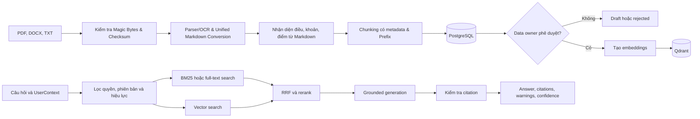
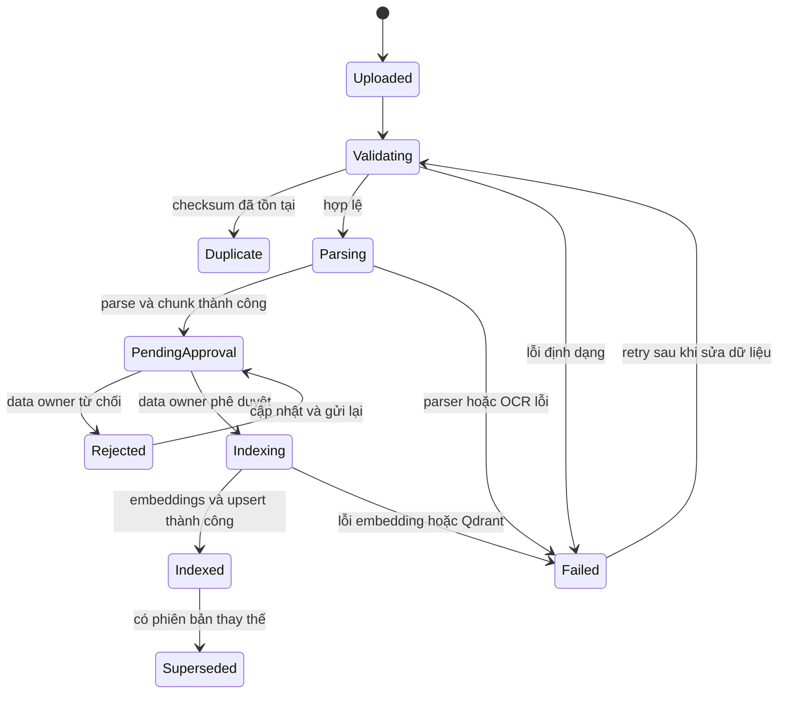

# Module RAG và Database — PolicyMeta AI

Module này cung cấp pipeline nhập liệu, quản lý phiên bản văn bản, hybrid retrieval và sinh câu trả lời có trích dẫn cho PolicyMeta AI. Đây là phần đóng góp độc lập của hệ thống tra cứu quy định, quy chế; module được backend tích hợp thông qua các service và `RAGContainer` thay vì tự cung cấp giao diện hoặc API công khai.

## 1. Mục tiêu

## 1. Mục tiêu

- Nhập và chuẩn hóa tài liệu PDF, DOCX và TXT; kiểm tra định dạng Magic Bytes (chống giả mạo/file hỏng), hỗ trợ OCR khi tài liệu không có text layer và chuyển đổi về định dạng Markdown thống nhất.
- Nhận diện cấu trúc chương, mục, điều, khoản, điểm từ Markdown và tạo chunk có thể truy vết về nguồn.
- Quản lý metadata, checksum, phiên bản, hiệu lực, quan hệ thay thế và trạng thái phê duyệt.
- Kết hợp tìm kiếm từ khóa với vector search, sau đó RRF và rerank để chọn đúng căn cứ.
- Lọc tài liệu theo quyền truy cập, trạng thái phê duyệt, phiên bản và thời điểm hiệu lực.
- Sinh câu trả lời chỉ dựa trên các chunk đã truy xuất và kiểm tra citation trước khi trả kết quả.
- Hỗ trợ kiểm thử retrieval, groundedness, citation correctness và độ chính xác chọn phiên bản.

## 2. Ranh giới module

Module **không sở hữu**:

- Frontend hoặc chatbot UI.
- FastAPI routes và streaming HTTP response.
- Đăng nhập, quản lý phiên hoặc phát hành token.
- Màn hình upload, phê duyệt và quản trị tài liệu.
- Báo cáo, nhắc việc hoặc các tác vụ nghiệp vụ ngoài tra cứu RAG.

Backend chịu trách nhiệm xác thực người dùng và ánh xạ thông tin đáng tin cậy thành `UserContext`. RBAC trong module chỉ là lớp lọc metadata trước hoặc trong retrieval; module không tin cậy role, đơn vị hoặc access level do client tự khai báo.

Module trả về `answer`, `citations`, `warnings`, `confidence` và metadata retrieval. Module không tự quyết định cách frontend trình bày các trường này.

## 3. Nguyên tắc dữ liệu

1. **PostgreSQL là nguồn dữ liệu chuẩn** cho metadata, phiên bản, cấu trúc văn bản, trạng thái phê duyệt, quyền truy cập và audit.
2. **Qdrant là chỉ mục vector có thể tái tạo**, không phải nơi lưu trạng thái nghiệp vụ độc lập.
3. **Chỉ phiên bản đã được phê duyệt mới được tạo embeddings và index** để phục vụ người dùng cuối.
4. **Quyền truy cập, hiệu lực và trạng thái phiên bản phải được lọc trước khi xếp hạng**.
5. **Phiên bản đã bị thay thế không xuất hiện trong truy vấn hiện hành**, trừ khi người dùng yêu cầu rõ mốc lịch sử.
6. **Không đủ bằng chứng thì không suy diễn**; pipeline phải trả cảnh báo hoặc safe fallback.
7. **Mỗi kết luận quan trọng phải có citation** ánh xạ đến document, version, section và chunk cụ thể.

## 4. Kiến trúc module



## 5. Cấu trúc mã nguồn

| Đường dẫn | Trách nhiệm |
|---|---|
| `src/ingestion/` | Kiểm tra Magic Bytes file, parse PDF/DOCX/TXT, chuyển đổi Markdown, OCR, nhận diện cấu trúc và chunking |
| `src/services/embeddings.py` | Hash embedding cho kiểm thử và embedding provider dùng trong runtime |
| `src/retrieval/` | Keyword/BM25, vector search, hybrid retrieval, RRF và rerank |
| `src/rag/` | Cấu hình, composition root, orchestration, sinh câu trả lời và kiểm tra citation |
| `src/db/` | Schema, repository, version tracking, hiệu lực, phê duyệt và audit dữ liệu |
| `migrations/` | Database migrations |
| `scripts/` | Nạp tài liệu và chạy đánh giá retrieval/RAG |
| `eval/` | Golden dataset, cấu hình và kết quả đánh giá |
| `tests/test_rag/` | Kiểm thử ingestion, retrieval, versioning, access control và citation |

## 6. Luồng nhập liệu và lập chỉ mục

1. Nhận file và metadata từ backend hoặc CLI.
2. Kiểm tra MIME type, Magic Bytes signature, checksum, trùng lặp và dữ liệu bắt buộc.
3. Parse text và chuyển đổi tài liệu sang định dạng Markdown chuẩn (Unified Markdown Intermediate Representation); dùng OCR (Docling) khi tài liệu scan không có text layer.
4. Chuẩn hóa nội dung Markdown và nhận diện chương, mục, điều, khoản, điểm.
5. Tạo section và chunk có metadata, content hash và liên kết về file nguồn.
6. Lưu phiên bản ở trạng thái draft hoặc pending approval trong PostgreSQL.
7. Data owner phê duyệt hoặc từ chối phiên bản thông qua backend/frontend.
8. Chỉ phiên bản đã phê duyệt mới được tạo embeddings và upsert vào Qdrant.
9. Cập nhật `index_status` sau khi toàn bộ bước index thành công.

Ingestion và re-index phải idempotent. Nếu embedding hoặc Qdrant lỗi, phiên bản không được đánh dấu `indexed` và không được dùng cho retrieval.

## 7. Luồng truy xuất và sinh câu trả lời

1. Nhận câu hỏi, `UserContext`, conversation context tùy chọn, `as_of_date` và `search_mode`.
2. Chuẩn hóa câu hỏi, xác định từ khóa, thực thể và phạm vi thời gian.
3. Tạo filter theo quyền, đơn vị, trạng thái phê duyệt, trạng thái index và hiệu lực.
4. Chạy keyword/full-text search và vector search song song.
5. Hợp nhất kết quả bằng Reciprocal Rank Fusion, loại trùng và rerank.
6. Kiểm tra ngưỡng bằng chứng trước khi gọi generator.
7. Sinh câu trả lời chỉ từ selected chunks.
8. Kiểm tra grounding, quyền truy cập và tính hợp lệ của citation.
9. Trả kết quả hợp lệ hoặc safe fallback nếu nguồn không đủ hay citation thất bại.

## 8. Hợp đồng tích hợp

### 8.1. Đầu vào tối thiểu

```json
{
  "question": "Quy định hiện hành về nội dung cần tra cứu là gì?",
  "user_context": {
    "user_id": "user-id",
    "roles": ["staff"],
    "unit_codes": ["unit-code"],
    "access_scope": "PUBLIC"
  },
  "conversation_context": [],
  "as_of_date": "YYYY-MM-DD",
  "search_mode": "current"
}
```

`UserContext` phải được backend tạo từ dữ liệu xác thực. Không nhận trực tiếp role hoặc đơn vị do frontend tự gửi mà chưa kiểm chứng.

### 8.2. Đầu ra

```json
{
  "answer": "Nội dung trả lời đã được grounding",
  "citations": [
    {
      "document_id": "uuid",
      "version_id": "uuid",
      "document_number": "string",
      "title": "string",
      "structure_path": "Điều 5, Khoản 2",
      "chunk_id": "uuid",
      "excerpt": "Trích đoạn hỗ trợ câu trả lời",
      "source_uri": "string"
    }
  ],
  "warnings": [],
  "confidence": 0.0,
  "retrieval": {
    "candidate_count": 0,
    "selected_chunk_ids": ["uuid"]
  }
}
```

`confidence` chỉ là tín hiệu hỗ trợ đã được hiệu chỉnh bằng tập đánh giá. Citation và warning luôn là căn cứ chính để người dùng kiểm chứng phản hồi.

## 9. Cài đặt và kiểm thử

Ví dụ trên Windows PowerShell:

```powershell
py -m venv .venv
.\.venv\Scripts\python.exe -m pip install -r requirements-rag.txt
Copy-Item .env.rag.example .env.rag
.\.venv\Scripts\python.exe -m pytest tests\test_rag -q
```

Không commit `.env.rag`, API key, database credentials hoặc thông tin nhạy cảm vào repository.

## 10. Nạp dữ liệu không qua API

Xem các tham số được CLI hỗ trợ:

```powershell
.\.venv\Scripts\python.exe scripts\ingest_document.py --help
```

CLI sử dụng cùng ingestion service và repository với backend để tránh tạo hai luồng xử lý dữ liệu khác nhau. File được nạp bằng CLI vẫn phải tuân theo validation, versioning, approval và indexing lifecycle của module.

## 11. Tích hợp với backend

Module cung cấp `RAGContainer` tại `src.rag.container`. Backend có thể sử dụng các dependency chính:

- `container.ingestion`: nhận và xử lý phiên bản tài liệu.
- `container.repository`: thao tác metadata, phiên bản, section, chunk, approval và audit.
- `container.pipeline`: thực thi retrieval, grounded generation và citation validation.

Backend nên đảm nhận:

1. Xác thực request và xây dựng `UserContext`.
2. Kiểm tra quyền ở endpoint trước khi gọi module.
3. Gọi service thích hợp từ `RAGContainer`.
4. Gắn `request_id`, chuẩn hóa lỗi và streaming response nếu cần.
5. Kiểm tra lại quyền trước khi hiển thị citation, excerpt hoặc file nguồn.
6. Ghi audit log cho upload, phê duyệt, từ chối, supersede, re-index và delete.

## 12. Trạng thái tài liệu cần hỗ trợ



Tên enum trong code có thể khác cách trình bày trên sơ đồ, nhưng phải duy trì cùng ý nghĩa nghiệp vụ và không cho retrieval sử dụng dữ liệu chưa sẵn sàng.

## 13. Kiểm thử tối thiểu

| Nhóm | Trường hợp cần bao phủ |
|---|---|
| Ingestion | File sai định dạng, trùng checksum, lỗi OCR/parser, retry và idempotency |
| Versioning | Chọn đúng phiên bản hiện hành, truy vấn lịch sử và văn bản bị thay thế |
| Access control | Role hoặc đơn vị khác nhau nhận tập kết quả đúng quyền |
| Retrieval | Keyword, vector, RRF, rerank và recall của điều khoản đúng |
| Groundedness | Không thêm khẳng định ngoài selected chunks; fallback khi nguồn không đủ |
| Citation | Citation đúng document, version, section, chunk và hỗ trợ trực tiếp cho câu trả lời |
| Synchronization | PostgreSQL và Qdrant nhất quán sau index, re-index, supersede hoặc delete |

## 14. Tài liệu liên quan

- [`ARCHITECTURE.md`](./ARCHITECTURE.md): kiến trúc hệ thống, quyết định thiết kế, bảo mật và triển khai.
- [`architecture_diagram.md`](./architecture_diagram.md): sơ đồ tổng thể, luồng hỏi đáp và luồng quản trị tài liệu.
- [`rag_database_architecture.md`](./rag_database_architecture.md): schema logic, payload Qdrant, vòng đời dữ liệu và hợp đồng module chi tiết.
- [`README.md`](./README.md): tổng quan sản phẩm, cách chạy toàn hệ thống và cấu trúc repository.
