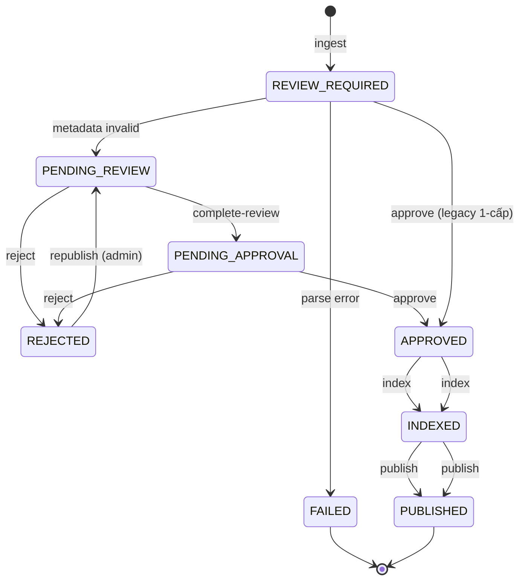

# Data Processing & Lifecycle Flow

> **Cập nhật 2026-09-03:** Luồng 2 cấp phê duyệt — `PENDING_REVIEW` →
> `PENDING_APPROVAL` → `APPROVED`.

## 1. Luồng chuẩn (Source of Truth)

Một văn bản pháp quy (Document) có thể có nhiều phiên bản (DocumentVersion). Mỗi phiên bản đi qua **đúng một lần** các bước sau:

```text
Upload
  → Parse / Chunk
  → PENDING_REVIEW (metadata không chuẩn)
     → PENDING_APPROVAL (reviewer xem xét OK)
        → APPROVED (admin duyệt cuối)
           → INDEXED
              → PUBLISHED
```

### 1a. Metadata validation (Phase 3)

Khi upload hoặc parse, hệ thống kiểm tra:

| Trường | Validation |
|--------|-----------|
| Số hiệu văn bản | Format: `123` hoặc `123/QĐ-ĐHBK` |
| Cơ quan ban hành | Không rỗng |
| Ngày ban hành | Hợp lệ |
| Ngày có hiệu lực | Hợp lệ, không trước ngày ban hành |

Nếu **không đạt**: tự động set `PENDING_REVIEW`.

### 1b. 2-cấp phê duyệt

| Bước | API | Trạng thái trước | Trạng thái sau | Actor |
|------|-----|------------------|----------------|-------|
| 1. Upload/Ingest | `POST /admin/documents/ingest` | (mới) | `REVIEW_REQUIRED` | Admin |
| 2a. Metadata invalid → | auto | `PENDING_REVIEW` | - | Hệ thống |
| 2b. Hoàn thành xem xét | `POST /admin/documents/{id}/complete-review` | `PENDING_REVIEW` | `PENDING_APPROVAL` | Reviewer (có quyền `document.review`) |
| 2c. Từ chối | `POST /admin/documents/{id}/reject` | `PENDING_REVIEW` hoặc `PENDING_APPROVAL` | `REJECTED` | Reviewer / Admin |
| 3. Duyệt cuối | `POST /admin/documents/{id}/approve` | `PENDING_APPROVAL` | `APPROVED` | Admin |
| 4. Tạo vector | `POST /admin/documents/{id}/index` | `APPROVED` | `INDEXED` | Admin |
| 5. Xuất bản | `POST /admin/documents/{id}/publish` | `INDEXED` | `PUBLISHED` | Admin |
| 6. Xuất bản lại | `POST /admin/documents/{id}/republish` | `REJECTED` | `PENDING_REVIEW` | Admin |

### 1c. Notification trigger

Khi document vào `PENDING_REVIEW` → gửi notification cho:
- Users có permission `document.review`
- Admins

Khi document vào `PENDING_APPROVAL` → gửi notification cho:
- Admins

## 2. State Machine (Phase 3b)



**Note:** Legacy 1-cấp `REVIEW_REQUIRED → APPROVED` vẫn hoạt động cho tài liệu metadata đạt chuẩn.

## 3. ProcessingStatus enum (canonical)

Xem `src/domain/schemas.py`:

```python
class ProcessingStatus(StrEnum):
    RECEIVED = "received"
    QUEUED = "queued"
    QUARANTINED = "quarantined"
    PARSED = "parsed"
    REVIEW_REQUIRED = "review_required"
    PENDING_REVIEW = "pending_review"       # NEW (2026-09-03)
    PENDING_APPROVAL = "pending_approval"  # NEW (2026-09-03)
    APPROVED = "approved"
    REJECTED = "rejected"                 # NEW (2026-09-03)
    INDEXED = "indexed"
    PUBLISHED = "published"
    FAILED = "failed"
```

## 4. Ràng buộc về trạng thái

### 4.1. Publish chỉ được gọi từ `INDEXED`

`repository.publish_version` **từ chối** publish khi `processing_status` không phải `INDEXED`:

```python
if version.processing_status != ProcessingStatus.INDEXED.value:
    raise ValueError("Version must be Indexed before publishing.")
```

### 4.2. Approve chỉ được gọi từ `PENDING_APPROVAL`

`ApproveDocumentHandler` **từ chối** approve khi `processing_status` không phải `PENDING_APPROVAL`:

```python
if current != ProcessingStatus.PENDING_APPROVAL:
    raise ConflictException(
        "Cannot approve from status '{current.value}'. "
        "Use /complete-review first."
    )
```

### 4.3. Index fail → giữ `APPROVED` + trả lỗi rõ ràng

`IngestionPipeline.index_approved_version` chia làm 3 phase:

1. **Phase 1 (read-only snapshot)**: đọc `DocumentVersion` + `chunks` từ PostgreSQL.
2. **Phase 2 (heavy work)**: embed + Qdrant upsert. Bao bọc trong `try / except`.
3. **Phase 3 (commit)**: chỉ chạy `mark_indexed(...)` khi Phase 2 thành công.

```python
# src/ingestion/pipeline.py
try:
    ...
    await self.vector_store.upsert(records)
except Exception as exc:
    raise RuntimeError(
        f"Index thất bại cho version_id={version_id}. "
        f"Phiên bản vẫn ở trạng thái APPROVED để retry. Lỗi: "
        f"{type(exc).__name__}: {exc}"
    ) from exc

# Phase 3 chỉ chạy khi Phase 2 OK
self.repository.mark_indexed(version_id)
```

Khi index fail, route `/admin/documents/{id}/index` trả **HTTP 502** với thông báo chi tiết, version **vẫn ở `APPROVED`** để operator xem lỗi và retry.

## 3. Ánh xạ API ↔ Bước

| Bước | Endpoint | Status code khi thành công | Status code khi lỗi |
|------|----------|---------------------------|---------------------|
| Upload | `POST /api/v1/admin/documents/ingest` | 200 | 400 (validation) |
| Approve | `POST /api/v1/admin/documents/{id}/approve` | 200 | 400 (status), 403 (role) |
| Index | `POST /api/v1/admin/documents/{id}/index` | 200 | 400 (status), 502 (Qdrant) |
| Publish | `POST /api/v1/admin/documents/{id}/publish` | 200 | 400 (status), 403 (role) |

## 4. OCR / PDF Config

Cấu hình parser PDF hiện tại (sau refactor 2026-08-25) đã được rút gọn về
`PARSER_BACKEND` duy nhất (`auto` / `pypdf` / `pypdf_table` / `docling` —
`docling` hiện map sang `pypdf`). Toàn bộ trường `docling_enabled`,
`ocr_*`, `preprocess_*`, `vlm_*` đã được **gỡ khỏi** `RAGSettings`. Xem
chi tiết tại [`docs/PDF_PROCESSING.md`](PDF_PROCESSING.md) — bao gồm
stack hiện tại, nguyên tắc, các backend parser được hỗ trợ và kế hoạch
tích hợp OCR API bên ngoài.

OCR sẽ được tích hợp lại khi có API bên ngoài; cho tới lúc đó, `pypdf` +
`pdfplumber` đủ dùng cho toàn bộ batch HUST (born-digital).

## 5. Môi trường Docker

`Dockerfile` cài đủ dependency để chạy OCR/PDF trong container, khớp với local Conda:

```dockerfile
# Build stage: cần gcc cho pymupdf, easyocr, docling
RUN apt-get update && apt-get install -y --no-install-recommends \
        build-essential gcc g++ libpq-dev libgl1 libglib2.0-0 poppler-utils

# Runtime stage: cần libgl + poppler + tesseract
RUN apt-get update && apt-get install -y --no-install-recommends \
        libpq5 libgl1 libglib2.0-0 poppler-utils tesseract-ocr
```

Cả build và runtime đều dùng `requirements-docling.txt` (chứa `pymupdf`, `easyocr`, `docling`, `opencv-python-headless`, `scikit-image`).

## 6. Script End-to-End

`scripts/ingest_hust_corpus.py` chạy đúng luồng `ingest → approve → index → publish`:

```bash
# Chạy nhanh (chỉ PDF text, không OCR)
python scripts/ingest_hust_corpus.py --approve-publish

# Chạy với OCR cho scan PDFs
python scripts/ingest_hust_corpus.py --approve-publish --ocr --parser-backend auto

# Chạy với OCR + GPU
python scripts/ingest_hust_corpus.py --approve-publish --ocr --ocr-gpu
```

## 7. Test Contracts

| Test | File | Bảo vệ |
|------|------|--------|
| `test_publish_blocks_when_status_is_only_approved` | `tests/test_db_repository_publish_gate.py` | Publish không được phép từ APPROVED |
| `test_publish_blocks_when_status_is_failed` | `tests/test_db_repository_publish_gate.py` | Publish không được phép từ FAILED |
| `test_publish_succeeds_only_when_indexed` | `tests/test_db_repository_publish_gate.py` | Chỉ publish được khi INDEXED |
| `test_index_approved_version_raises_runtime_when_vector_store_fails` | `tests/test_ingestion_pipeline_flow.py` | Qdrant fail → RuntimeError, không mark_indexed |
| `test_index_approved_version_calls_mark_indexed_only_on_success` | `tests/test_ingestion_pipeline_flow.py` | mark_indexed chỉ chạy khi upsert OK |
| `test_publish_blocked_when_repository_rejects_unindexed_state` | `tests/test_rag/test_admin_routes.py` | API publish trả 400 với message rõ |
| `test_index_endpoint_indexes_approved_version` | `tests/test_rag/test_admin_routes.py` | API index → 200 |
| `test_index_endpoint_returns_502_when_indexing_fails` | `tests/test_rag/test_admin_routes.py` | API index fail → 502, status stays APPROVED |

## 8. Kết quả End-to-End (HUST corpus, 2026-08-13)

| File | Trạng thái | Sections | Chunks | Notes |
|------|------------|----------|--------|-------|
| 10232.pdf | `published` | 27 | 46 | QĐ học phí 2025-2026 |
| 10728.pdf | `published` | 70 | 77 | Quy định ngoại ngữ |
| 2048.pdf | `published` | 71 | 77 | Phân loại trình độ NN |
| 5445.pdf | `published` | existing | existing | Quy chế đào tạo |
| 5980.pdf | `failed` | – | – | Scan PDF, cần OCR bật |
| 6100.pdf | `failed` | – | – | Scan PDF, cần OCR bật |
| 7323.pdf | `failed` | – | – | Scan PDF, cần OCR bật |
| 7737.pdf | `published` | 27 | 27 | Bộ tiêu chí CĐT kỹ sư |

Query test (3/3 `outcome: generated`):

| Query | Citations | Thời gian |
|-------|-----------|-----------|
| "Quyết định số 10232 quy định mức học phí 2025-2026 như thế nào?" | 2 từ `QĐ-ĐHBK-10232` | ~15s |
| "Theo quy chế ĐHBK, sinh viên ra trường phải đạt chuẩn ngoại ngữ gì?" | 1 từ `10728/QĐ-ĐHBK` | ~10s |
| "Bộ tiêu chí chương trình đào tạo kỹ sư chuyên sâu quy định điều kiện gì?" | 2 từ `7737/QĐ-ĐHBK` | ~14s |

## 9. Liên kết

- `docs/E2E_HUST_10232_TEST.md` – log test chi tiết cho 10232.pdf
- `docs/ARCHITECTURE_CHANGES_MULTI_PROVIDER.md` – thay đổi multi-provider
- `docs/pdf_processing_pipeline.md` – spec PDF processor đầy đủ
- `src/db/repository.py` – `publish_version`, `mark_indexed`
- `src/ingestion/pipeline.py` – `ingest`, `index_approved_version`
- `src/api/admin_routes.py` – `upload`, `approve`, `index`, `publish`

## 10. Retry & Fallback cho LLM / Embedding (2026-08-13)

Khi provider bị rate-limit (429 RPM/TPM) hoặc lỗi tạm thời (timeout, 5xx), hệ thống tự động:

1. **Retry với exponential backoff + jitter**: tối đa `LLM_MAX_RETRIES` / `EMBEDDING_MAX_RETRIES` lần, mỗi lần chờ `base_delay × 2^attempt` giây (±20% jitter).
2. **Fallback qua provider chain**: sau khi hết retry → chuyển sang provider tiếp theo trong chain.
3. **Fallback cuối cùng**: luôn là provider an toàn (`template` cho LLM, `hash` cho embedding) — không cần API key và không bao giờ fail.

### 10.1. Cấu hình

```dotenv
# Retry
LLM_MAX_RETRIES=3
LLM_RETRY_BASE_DELAY=2.0
LLM_RETRY_MAX_DELAY=60.0

EMBEDDING_MAX_RETRIES=3
EMBEDDING_RETRY_BASE_DELAY=1.0
EMBEDDING_RETRY_MAX_DELAY=30.0

# Fallback chain (đánh giá theo thứ tự)
LLM_FALLBACK_PROVIDERS=ollama,template
EMBEDDING_FALLBACK_PROVIDERS=sentence_transformers,hash
```

### 10.2. Luồng hoạt động

```mermaid
flowchart TD
    A[LLM/Embedding call] --> B{Provider gọi thành công?}
    B -->|Có| Z[Trả kết quả]
    B -->|Lỗi tạm thời (429/5xx)| C{Còn retry?}
    C -->|Có| D[Chờ backoff]
    D --> B
    C -->|Hết retry| E{Còn fallback provider?}
    E -->|Có| F[Thử provider tiếp theo]
    F --> B
    E -->|Hết chain| G[Fallback cuối: template / hash]
    G --> Z
```

### 10.3. Exception classification

```python
# src/services/retry_utils.py
_RETRYABLE_MSG_SUBSTRINGS = (
    "rate limit", "429", "503", "502", "500",
    "timeout", "quota", "throttl", "too many requests",
)
# rate-limit cụ thể (429/TPM) dùng base_delay
# 5xx / timeout dùng base_delay * 2 (chờ lâu hơn)
```

### 10.4. Components

| File | Class/Function | Vai trò |
|------|----------------|---------|
| `src/services/retry_utils.py` | `with_retry()`, `backoff_delay()` | Exponential backoff + jitter |
| `src/services/llm_resilient.py` | `MultiProviderResilientLLM` | Retry + fallback chain cho LLM |
| `src/services/embeddings.py` | `ResilientEmbeddingProvider` | Retry + fallback chain cho embedding |
| `src/rag/generator.py` | `MultiProviderAnswerGenerator` | Dùng `MultiProviderResilientLLM` |

### 10.5. Tests (24 tests mới)

- `tests/test_services/test_retry_utils.py`: `is_retryable`, `backoff_delay`, `with_retry`, `on_retry` callback.
- `tests/test_services/test_embedding_resilient.py`: retry thành công, fallback sau exhausted, non-retryable error propagation.
- `tests/test_services/test_llm_resilient.py`: config parsing, chain init, skip duplicate.

**348/348 tests pass.**
