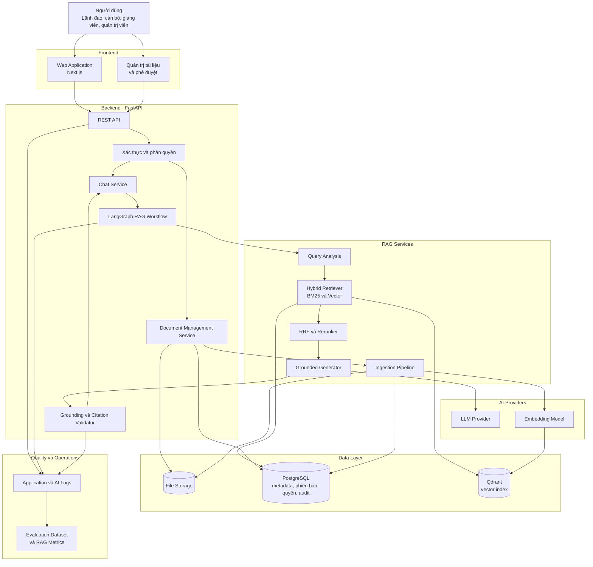
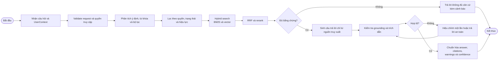
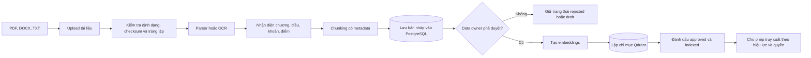

# Sơ đồ kiến trúc tổng thể — PolicyMeta AI

Tài liệu này mô tả kiến trúc logic của PolicyMeta AI ở mức hệ thống. Trọng tâm của MVP là tra cứu quy định, quy chế nội bộ bằng RAG, ưu tiên đúng phiên bản văn bản, kiểm soát quyền truy cập và trả lời kèm trích dẫn có thể kiểm chứng.

## 1. Kiến trúc tổng thể

## 2. Luồng xử lý câu hỏi

## 3. Luồng nhập và phát hành tài liệu

## 4. Trách nhiệm các thành phần

| Thành phần | Công nghệ hoặc hình thức | Trách nhiệm chính |
|---|---|---|
| Web Application | Next.js | Giao diện hỏi đáp, hiển thị trích dẫn, lịch sử và cảnh báo |
| Quản trị tài liệu | Next.js | Upload tài liệu, nhập metadata, phê duyệt và quản lý phiên bản |
| REST API | FastAPI | Validate request, cung cấp endpoint, streaming và chuẩn hóa lỗi |
| Xác thực và phân quyền | Backend middleware/service | Tạo `UserContext`, kiểm tra vai trò và phạm vi tài liệu |
| LangGraph RAG Workflow | LangGraph | Điều phối các bước phân tích, truy xuất, sinh và kiểm tra câu trả lời |
| Hybrid Retriever | PostgreSQL full-text search + Qdrant | Kết hợp tìm kiếm từ khóa và ngữ nghĩa |
| RRF và Reranker | RAG service | Hợp nhất, xếp hạng lại và loại đoạn ít liên quan |
| Grounded Generator | LLM abstraction | Tổng hợp câu trả lời chỉ dựa trên các đoạn đã chọn |
| Citation Validator | Rule-based + model-assisted | Kiểm tra mỗi kết luận có nguồn hỗ trợ và citation hợp lệ |
| PostgreSQL | Database chính | Nguồn dữ liệu chuẩn cho metadata, phiên bản, cấu trúc văn bản, quyền và audit |
| Qdrant | Vector database | Lưu vector của chunk và payload phục vụ lọc trước khi tìm kiếm |
| File Storage | Local hoặc object storage | Lưu file gốc và file đã xử lý; lựa chọn triển khai phụ thuộc môi trường |
| Logs và Evaluation | Application logs, AI logs, bộ eval | Theo dõi chất lượng, lỗi, latency, retrieval và citation correctness |

## 5. Ranh giới hệ thống

- Frontend không truy cập trực tiếp PostgreSQL hoặc Qdrant; mọi thao tác đi qua FastAPI.
- Module RAG nhận `UserContext` đã được backend xác thực và không tự triển khai đăng nhập.
- PostgreSQL là nguồn dữ liệu chuẩn; Qdrant chỉ là chỉ mục có thể tái tạo từ dữ liệu đã phê duyệt.
- Tài liệu chưa được phê duyệt hoặc chưa lập chỉ mục không được dùng để trả lời người dùng cuối.
- Phiên bản cũ được giữ để tra cứu lịch sử nhưng bị loại khỏi truy vấn hiện hành khi đã bị thay thế, trừ khi người dùng yêu cầu rõ mốc lịch sử.
- Hệ thống không khẳng định khi bằng chứng không đủ; phản hồi phải có `warnings` và mức `confidence` phù hợp.
