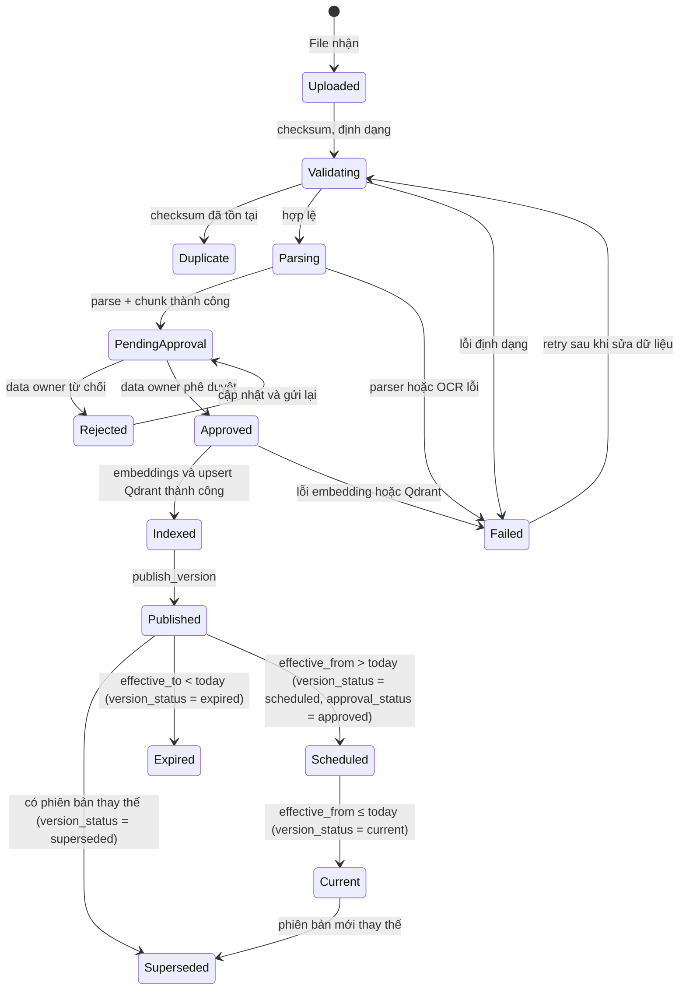

# Kiến trúc module RAG và database — PolicyMeta AI

> Tài liệu **as-built** mô tả pipeline nhập liệu, truy xuất, mô hình dữ liệu logic và hợp đồng đầu ra của module RAG đã được triển khai trong `src/`, `migrations/` và `src/rag/`. Các quyết định dưới đây **giữ nguyên định hướng gốc** (PostgreSQL là nguồn sự thật, Qdrant là chỉ mục có thể tái tạo, chỉ dữ liệu đã phê duyệt mới phục vụ người dùng cuối, citation-first, fail-closed khi thiếu căn cứ) và ghi nhận các khác biệt so với bản thiết kế ban đầu.
>
> Viết từ góc nhìn **PO** (mục tiêu nghiệp vụ, ranh giới, hợp đồng I/O) và **Tech Lead** (cách hiện thực hoá, kiến trúc thành phần, luồng điều phối).

---


## 1. Nguyên tắc thiết kế

1. **PostgreSQL là nguồn dữ liệu chuẩn** — metadata, phiên bản, trạng thái phê duyệt/xuất bản, cấu trúc văn bản, quyền truy cập và audit log đều nằm ở đây.
2. **Qdrant (hoặc in-memory) là chỉ mục truy xuất** — lưu dense vector, sparse vector và payload tối thiểu cần cho filter; toàn bộ có thể xóa và tái tạo từ PostgreSQL.
3. **Chỉ dữ liệu đã phê duyệt và xuất bản mới phục vụ người dùng cuối** — chunk thuộc văn bản `draft / scheduled / rejected / failed` hoặc version `superseded / expired` (mặc định) bị loại khỏi truy vấn hiện hành.
4. **Lọc trước khi xếp hạng** — quyền truy cập, hiệu lực, phạm vi tenant và trạng thái pháp lý được áp dụng ngay tại pre-filter của Qdrant và PostgreSQL.
5. **Citation-first** — mỗi kết luận phải trỏ về `chunk_id` đã qua rerank + expansion, chỉ chấp nhận metadata sao chép từ `final_contexts`; mọi URL/vị trí do LLM tự tạo đều bị bác.
6. **Không đủ nguồn thì không suy diễn** — `EvidenceGate` quyết định `generate / retry / abstain / human_escalation`; generator không bao giờ tự do trả lời nếu bằng chứng không đạt ngưỡng.
7. **Fail-closed** — mọi policy, filter, model và audit mặc định từ chối khi thiếu thông tin hoặc lỗi; không có "im lặng cho qua".

> ✱ **Khác biệt với bản gốc** — đã bổ sung rõ nguyên tắc **fail-closed** và **tách bạch phê duyệt nội dung (**`processing_status`**) với hiệu lực pháp lý (**`legal_status`**)**, phản ánh đúng trạng thái `published` hiện đang là điều kiện cần để một chunk xuất hiện trong retrieval.

---


## 2. Pipeline nhập liệu và lập chỉ mục


### 2.1. Sơ đồ

```mermaid
flowchart LR
    A[PDF, DOCX, TXT] --> B[File validation<br/>Magic Bytes signature, SHA-256, giới hạn MB]
    B --> C{Đã có<br/>checksum?}
    C -->|Có| C1[Báo trùng lặp]
    C -->|Không| D[Save quarantine<br/>filesystem]
    D --> E[Parser & Unified Markdown<br/>native hoặc Docling OCR]
    E -->|Thất bại| EF[processing_status = failed]
    E --> F[Nhận diện Điều, Khoản, Điểm từ Markdown]
    F --> G[Chunking có overlap + Context Prefix + metadata]
    G --> H[(PostgreSQL<br/>documents, document_versions,<br/>provisions, chunks)]
    H --> I[processing_status = review_required]
    I --> J{Data owner approve?}
    J -->|Rejected| K[Giữ lịch sử<br/>approved_by = None]
    J -->|Approved| L[Status = approved]
    L --> M[Tạo embeddings + upsert Qdrant]
    M --> N[Status = indexed]
    N --> O[publish_version<br/>legal_status = effective hoặc scheduled]
    O --> P[Khả dụng cho retrieval]
```




### 2.2. Trạng thái vòng đời (as-built)

`processing_status` (luồng nghiệp vụ) và `legal_status` (hiệu lực pháp lý) **tách rời** để hỗ trợ duyệt trước — xuất bản sau và thay thế phiên bản:

- `processing_status`: `received` → `quarantined` → `parsed` → `review_required` → `approved` → `indexed` → `published` (hoặc `failed` ở bất kỳ bước nào).
- `legal_status`: `draft` → `scheduled` (có `effective_from` tương lai) → `effective` → `superseded` (bị thay thế bởi version mới) | `expired` (qua `effective_to`) | `revoked`.
- `refresh_current_legal_statuses()` chạy trước mỗi truy vấn: chuyển `scheduled → effective` khi đến hạn và `effective → expired` khi hết hạn.

> ✱ **Khác biệt với bản gốc** — bản gốc gộp `approval_status` + `version_status` thành hai cột riêng; triển khai hiện tại tách thành hai enum `processing_status` (workflow nghiệp vụ) và `legal_status` (hiệu lực), đồng thời thêm bước `published` để đánh dấu phiên bản đã publicly phục vụ retrieval. Trạng thái `Duplicate` (trùng checksum) giờ chỉ là cảnh báo "đã có phiên bản", vẫn cho phép người dùng nhập một phiên bản mới nếu khác `version_number`.


### 2.3. Metadata bắt buộc khi nhập tài liệu


| Nhóm              | Trường tối thiểu                                                                                              | Mục đích                                                  |
| ----------------- | ------------------------------------------------------------------------------------------------------------- | --------------------------------------------------------- |
| Nhận diện         | `document_id`, `title`, `document_number`, `document_type`, `issued_by`                                       | Xác định văn bản, hiển thị citation và audit              |
| Phiên bản         | `version_id`, `version_number`, `checksum` (SHA-256), `source_filename`, `source_path`, `replaces_version_id` | Chống trùng checksum, theo dõi thay thế, lưu vết file gốc |
| Hiệu lực          | `issued_date`, `effective_from`, `effective_to`, `legal_status`                                               | Chọn đúng văn bản theo thời điểm truy vấn                 |
| Phê duyệt         | `owner_department`, `approved_by`, `approved_at`, `published_at`, `processing_status`                         | Data owner kiểm soát phiên bản                            |
| Phân loại & quyền | `access_scope` (`PUBLIC` / `DEPARTMENT`), `allowed_departments`                                            | Lọc tài liệu theo `UserContext` (2-value `AccessScope`)      |
| Nguồn             | `source_url`, `metadata_json` (snapshot toàn bộ `DocumentMetadata`)                                           | Truy vết URL gốc và phục vụ tái lập chỉ mục               |
| Cấu trúc          | `Provision.heading_path`, `article`, `clause`, `point`, `page`                                                | Tái dựng Điều/Khoản/Điểm và citation locator              |


> ✱ **Khác biệt với bản gốc** — `allowed_roles` đã được lược bỏ ở metadata tài liệu vì policy tính vai trò chính từ `UserContext.roles` (kế thừa vai trò: `manager → staff`, `data_owner → staff`); `allowed_departments` được đưa lên `documents` thay vì `document_versions` để đơn giản hoá chia sẻ giữa các phiên bản. Chỉ số duy nhất (`UniqueConstraint`) nằm ở cặp `(document_id, version_number)`, không phải `checksum`.


### 2.4. Reference triển khai

- `src/ingestion/file_validator.py` — validate định dạng, Magic Bytes header signature và SHA-256 checksum.
- `src/ingestion/parser.py` — `pypdf` + `python-docx` + `parse_to_markdown()` + fallback `docling` OCR khi PDF không có lớp text.
- `src/ingestion/legal_structure.py` — regex `Điều/Khoản/Điểm/Chương/Mục/Phần`, gom `Provision`.
- `src/ingestion/chunker.py` — gom `Provision.text` + Context Prefix Header (`Title | Doc Number | Heading Path`) + overlap ký tự (`chunk_max_chars`, `chunk_overlap_chars`).
- `src/ingestion/pipeline.py` — `IngestionPipeline.ingest()` + `IngestionPipeline.index_approved_version()`.
- `src/services/storage.py` — `LocalDocumentStorage` (`quarantine → raw`).
- `src/db/repository.py` — `create_document_version`, `save_provisions_and_chunks`, `approve_version`, `publish_version`, `refresh_current_legal_statuses`, `mark_indexed`.

---


## 3. Pipeline truy xuất và sinh câu trả lời


### 3.1. Sơ đồ (as-built)

Tất cả truy vấn người dùng cuối đều chạy qua **một graph duy nhất** (`RetrievalWorkflow`), topology được đóng cứng để không thể bypass bất kỳ bước nào:

```mermaid
flowchart LR
    Q[Câu hỏi + UserContext] --> N1[build_user_context_node]
    N1 -->|"thiếu AUTH → abstain"| END_ERR
    N1 --> N2[build_policy_node<br/>Qdrant Filter: tenant, status, classification, ACL, valid_from/to]
    N2 --> N3[transform_query_node<br/>identifier/keyword/semantic/mixed/multi_intent]
    N3 --> N4[hybrid_retrieve_node<br/>dense Qdrant + sparse Qdrant, hợp nhất RRF]
    N4 -->|"FORBIDDEN → abstain"| END_FB
    N4 --> N5[rerank_node<br/>CrossEncoder + circuit breaker + RRF fallback]
    N5 --> N6[expand_context_node<br/>parent heading, adjacent chunks, referenced definitions]
    N6 --> N7[evidence_gate_node<br/>sufficient / partial / weak / conflict / forbidden]
    N7 -->|"weak + còn attempt"| N8[rewrite_query_node]
    N8 --> N3
    N7 -->|"decision = GENERATE"| N9[generate_answer_node]
    N9 --> N10[validate_citation_node<br/>fail-closed: chỉ chấp nhận metadata từ final_contexts]
    N7 -->|"decision = ABSTAIN / HUMAN_ESCALATION"| N11[abstain_node<br/>safe fallback + human-in-loop interrupt]
    N11 -->|"retry được duyệt"| N3
    N11 -->|"approve / reject"| END_OK
    N10 --> END_OK
```




Mọi node đều được `_instrument_node` (observability) bọc và ghi nhận `latency`, `outcome`, `error_code`. Lỗi ở bất kỳ bước nào đều có `error_code` chuẩn hoá (`AUTH_CONTEXT_MISSING`, `RETRIEVAL_TIMEOUT`, `RERANK_FAILED`, `GENERATOR_MISSING`, …) và được ánh xạ sang `RetrievalStatus` tương ứng.

> ✱ **Khác biệt với bản gốc** — bản gốc mô tả pipeline đơn tuyến với "Revise 1 lần hoặc safe fallback". Triển khai hiện tại thay bằng **LangGraph** `RetrievalWorkflow` với:
>
> - `rewrite_query_node` cho phép tối đa `max_attempts` (mặc định 2) vòng retrieve lại sau khi `evidence_gate` xác định `weak`.
> - `validate_citation_node` chạy **sau** generator và bác bỏ mọi URL/vị trí LLM tự tạo (`validate_source_locations`).
> - `abstain_node` hỗ trợ **human-in-the-loop** qua LangGraph `interrupt` khi `status = CONFLICT`.
> - Mỗi cạnh là bắt buộc — caller không thể chèn nhánh bypass (compile graph là private parameter).


### 3.2. Quy tắc lọc phiên bản (as-built)

- Truy vấn hiện hành mặc định chỉ lấy version `processing_status = published` và `legal_status = effective` (khi không truyền `as_of_date`).
- Khi có `as_of_date`, danh sách trạng thái mở rộng: `effective / scheduled / superseded / expired` để phục vụ truy vấn lịch sử; giá trị `valid_from ≤ as_of ≤ valid_to` được kiểm tra ở cả PostgreSQL lẫn pre-filter Qdrant.
- `replaces_version_id` được dùng để đánh dấu `legal_status = superseded` cho version cũ trong `publish_version` và `refresh_current_legal_statuses`.
- Nếu `effective_from` / `effective_to` thiếu hoặc mâu thuẫn, version bị loại; các truy vấn đến vẫn chạy nhưng warning được pipeline sinh ra và `warnings` được trả về cho caller.


### 3.3. Payload đề xuất trong Qdrant (as-built)

Mỗi vector (dense + sparse) tương ứng với một chunk. Payload chỉ giữ dữ liệu cần cho filter, truy vết và tái lập citation; nội dung chuẩn vẫn nằm ở PostgreSQL.

```json
{
  "tenant_id": "hust",
  "document_id": "uuid",
  "version_id": "uuid",
  "chunk_id": "uuid5(version_id, 'chunk-N')",
  "parent_chunk_id": "uuid",
  "previous_chunk_id": "uuid",
  "next_chunk_id": "uuid",
  "owner_unit": "TCCB",
  "allowed_roles": ["staff", "manager"],
  "allowed_units": ["TCCB"],
  "classification": "internal",
  "status": "published",
  "valid_from": "2026-01-01T00:00:00Z",
  "valid_to": null,
  "page": 3,
  "section": "Điều 5",
  "document_number": "01/QĐ-ĐHBK",
  "title": "Quy định nghỉ phép",
  "source_url": "https://example.edu.vn/regulations/01",
  "legal_status": "effective",
  "content_hash": "sha256:0123456789abcdef",
  "embedding_model": "text-embedding-3-small",
  "embedding_version": "1",
  "sparse_model": "hashed-lexical",
  "sparse_version": "1",
  "index_version": "regulations-2026-08-04"
}
```

Các index payload được khai báo trong `PAYLOAD_INDEXES` (`src/retrieval/vector_store.py`) — đảm bảo filter chạy tại index, không phải scan.

> ✱ **Khác biệt với bản gốc** — payload đã được **mở rộng** để:
>
> - Hỗ trợ `tenant_id` (đa-tenant sẵn, giá trị được lấy từ `department.code` của user đang đăng nhập, không còn hard-code `hust`).
> - Lưu `parent_chunk_id`, `previous_chunk_id`, `next_chunk_id` phục vụ `expand_context_node`.
> - Theo dõi `content_hash`, `embedding_model`, `embedding_version`, `sparse_model`, `sparse_version`, `index_version` — bắt buộc cho việc re-index khi đổi model mà không phải wipe database.
> - Lưu `document_number`, `title`, `source_url` để citation không phải quay về PostgreSQL.
> - Bỏ `structure_path` trực tiếp; thay bằng `section/article/clause/point/page` rời rạc để validator đối chiếu từng trường.


### 3.4. Reranker, Diversity và Context Expansion

- **Reranker**: `CrossEncoderReranker` (`BAAI/bge-reranker-v2-m3`) được bọc bởi `RerankerService` có **circuit breaker** (mặc định 3 lần lỗi → cooldown 60s) và **timeout** (30s). Khi reranker lỗi, hệ thống **không abort** — tự động RRF-fallback và gắn `warning` rõ ràng.
- **Evidence rerank** (`src/retrieval/evidence_rerank.py`): cắt top-60, áp ngưỡng `rerank_score_threshold`, chọn điểm cắt bằng `detect_score_gap`, đa dạng hoá bằng **MMR** (`mmr_lambda = 0.85`), giới hạn tối đa 2 chunk / tài liệu, chọn 3–5 winning chunks.
- **Context expansion** (`src/retrieval/context_expansion.py`): với mỗi winning chunk, thêm `parent_chunk_id` (heading hoặc chunk cha), `previous_chunk_id`, `next_chunk_id`, `referenced_definition_chunk_ids` (tối đa 3). Mọi chunk phụ trợ đều phải vượt `can_access_document` (fail-closed) và được cắt theo `context_token_budget` (mặc định 3000 token).


### 3.5. Evidence Gate

`evaluate_evidence` (`src/retrieval/evidence_gate.py`) là điểm quyết định duy nhất:


| Trạng thái   | Điều kiện                                                                                                                | Quyết định                                    |
| ------------ | ------------------------------------------------------------------------------------------------------------------------ | --------------------------------------------- |
| `FORBIDDEN`  | upstream từ chối truy cập                                                                                                | `ABSTAIN` ngay, không retry                   |
| `CONFLICT`   | `detect_conflicts` thấy nhiều version `effective` cùng locator nhưng nội dung khác, hoặc upstream báo CONFLICT           | `HUMAN_ESCALATION` (interrupt)                |
| `NOT_FOUND`  | upstream rỗng hoặc `top_score` < `partial_top_score`                                                                     | `ABSTAIN`                                     |
| `WEAK`       | `top_score ≥ partial_top_score` nhưng chưa đạt `sufficient_top_score`                                                    | `RETRY` nếu còn attempt, ngược lại `ABSTAIN`  |
| `PARTIAL`    | đạt top-score nhưng thiếu `minimum_score_gap` / `minimum_independent_sources` / `citation_complete` / `versions_current` | `ABSTAIN` (không đưa bằng chứng chưa đủ chuẩn vào generator) |
| `SUFFICIENT` | đạt tất cả ngưỡng                                                                                                        | `GENERATE`                                    |


`EvidenceThresholds` được cấu hình theo **domain** (`general` + override `evidence_thresholds_by_domain`), phải hiệu chỉnh bằng bộ câu hỏi đánh giá; **không dùng** xác suất do LLM tự khai báo (giữ nguyên nguyên tắc gốc).

---


## 4. Mô hình dữ liệu logic

Sơ đồ ER dưới đây **follow theo thiết kế gốc** — giữ nguyên toàn bộ các thực thể và quan hệ đã định nghĩa ở bản thiết kế ban đầu (`DOCUMENTS`, `DOCUMENT_VERSIONS`, `SECTIONS`, `CHUNKS`, `INGESTION_JOBS`, `APPROVAL_RECORDS`, `ACCESS_POLICIES`, `DOCUMENT_RELATIONS`). **Triển khai ý tưởng** thể hiện qua cách mỗi bảng được hiện thực hoá cụ thể: tên cột, kiểu dữ liệu, enum, và ràng buộc phản ánh code đã có trong `src/db/models.py`.

```mermaid
erDiagram
    DOCUMENTS ||--o{ DOCUMENT_VERSIONS : "has"
    DOCUMENT_VERSIONS ||--o{ SECTIONS : "contains"
    SECTIONS ||--o{ SECTIONS : "parent_of"
    SECTIONS ||--o{ CHUNKS : "split_into"
    DOCUMENT_VERSIONS ||--o{ INGESTION_JOBS : "processed_by"
    DOCUMENT_VERSIONS ||--o{ APPROVAL_RECORDS : "reviewed_by"
    DOCUMENTS ||--o{ DOCUMENT_RELATIONS : "source"
    DOCUMENTS ||--o{ DOCUMENT_RELATIONS : "target"
    ACCESS_POLICIES ||--o{ DOCUMENT_VERSIONS : "controls"
    DOCUMENTS ||--o{ AUDIT_LOGS : "generates"
    DOCUMENTS ||--o{ USER_FEEDBACK : "receives"

    DOCUMENTS {
        uuid id PK "UUID v4, khóa chính"
        string title "Tiêu đề văn bản, VD: 'Quy định nghỉ phép'"
        string document_number UK "Số ký hiệu, VD: '01/QĐ-ĐHBK', unique"
        string document_type "Phân loại: quy định / quy chế / thông báo / công văn"
        string issued_by "Cơ quan ban hành, VD: 'Đại học Bách khoa Hà Nội'"
        string owner_unit "Đơn vị quản lý chủ trì, FK → ACCESS_POLICIES.unit_code"
        timestamp created_at
        timestamp updated_at
    }

    DOCUMENT_VERSIONS {
        uuid id PK "UUID v4, khóa chính"
        uuid document_id FK "→ DOCUMENTS.id, ON DELETE CASCADE"
        int version_number "Số phiên bản, VD: 1, 2, 3"
        string checksum UK "SHA-256 của file gốc, unique → chống upload trùng"
        string source_filename "Tên file gốc, VD: 'quydinh_nghiphep_v2.pdf'"
        string source_path "Đường dẫn filesystem: quarantine/ hoặc raw/"
        string approval_status "draft | review_required | approved | rejected"
        string index_status "pending | indexed | failed"
        string version_status "current | superseded | expired | revoked"
        date issued_date "Ngày ký"
        date effective_from "Ngày bắt đầu hiệu lực"
        date effective_to "Ngày hết hiệu lực, NULL = vô thời hạn"
        uuid supersedes_version_id FK "→ DOCUMENT_VERSIONS.id, thay thế phiên bản nào"
        string approved_by "User ID của người duyệt"
        datetime approved_at "Thời điểm duyệt"
        string owner_unit "Đơn vị chủ trì, redundant với DOCUMENT.owner_unit để JOIN đỡ phải truy qua DOCUMENTS"
        json metadata_json "Snapshot toàn bộ DocumentMetadata để tái lập chunk metadata khi re-index; khi auto-detect được dùng còn chứa document_number_candidates / document_number_recommended / document_number_human_review_required"
        timestamp created_at
    }

    SECTIONS {
        uuid id PK "UUID v4"
        uuid version_id FK "→ DOCUMENT_VERSIONS.id, ON DELETE CASCADE"
        uuid parent_id FK "→ SECTIONS.id, NULL = root section, hỗ trợ cấu trúc đa cấp (Chương > Điều > Khoản)"
        string section_type "chapter | article | clause | point"
        string section_number "VD: 'II', '5', '2', 'a'"
        string heading "Tiêu đề, VD: 'Điều 5. Cán bộ được nghỉ phép'"
        json heading_path "['Chương II', 'Điều 5. Cán bộ được nghỉ phép'], NULL = fallback"
        text content "Nội dung văn bản gốc, không qua chunking"
        int sort_order "Thứ tự xuất hiện trong văn bản"
    }

    CHUNKS {
        uuid id PK "UUID5(version_id, 'chunk-{chunk_index}') — deterministic, stable qua re-index"
        uuid section_id FK "→ SECTIONS.id, ON DELETE SET NULL"
        int chunk_index "Thứ tự chunk trong phiên bản, 0-based"
        text content "Nội dung chunk thuần (không prefix)"
        text embedding_text "Prefix + content: '{title} | {document_number} | {heading} \\n {content}', dùng để embed"
        string content_hash "SHA-256(content), phát hiện trùng lặp nội dung ở tầng embedding"
        int token_count "Số token ước lượng, dùng cho context_token_budget"
        string qdrant_point_id "Trùng với id, Qdrant dùng chunk_id làm point ID"
    }

    INGESTION_JOBS {
        uuid id PK "UUID v4"
        uuid version_id FK "→ DOCUMENT_VERSIONS.id, ON DELETE CASCADE"
        string status "received | quarantined | parsing | parsing_failed | chunking | indexing | failed"
        string parser_name "pypdf | docling | python-docx, ghi nhận parser nào đã xử lý"
        json parser_warnings "Cảnh báo từ bước parse, VD: ['DOCX không cung cấp số trang']"
        json chunking_warnings "Cảnh báo từ bước chunk, VD: ['Không nhận diện được cấu trúc Điều/Khoản']"
        text error_message "Lỗi chi tiết nếu status = failed"
        timestamp started_at
        timestamp completed_at
        int section_count "Số section nhận diện được"
        int chunk_count "Số chunk tạo ra"
    }

    APPROVAL_RECORDS {
        uuid id PK "UUID v4"
        uuid version_id FK "→ DOCUMENT_VERSIONS.id, ON DELETE CASCADE"
        string decision "approved | rejected | escalated"
        string reviewer_id "User ID của người duyệt"
        text note "Ghi chú của người duyệt, VD: lý do từ chối"
        json warnings_snapshot "Snapshot warnings tại thời điểm duyệt"
        timestamp decided_at
    }

    ACCESS_POLICIES {
        uuid id PK "UUID v4"
        string access_scope "PUBLIC | DEPARTMENT (canonical 2-value AccessScope)"
        json allowed_roles "['staff', 'manager', 'data_owner'], NULL = không giới hạn"
        json allowed_units "['TCCB', 'Đào tạo'], NULL = không giới hạn"
        string applies_to "document | version | section | chunk — phạm vi áp dụng"
        json applies_to_ids "Danh sách ID cụ thể nếu applies_to ≠ document"
        timestamp valid_from "Ngày policy có hiệu lực"
        timestamp valid_to "Ngày hết hiệu lực, NULL = vô thời hạn"
        timestamp created_at
    }

    DOCUMENT_RELATIONS {
        uuid id PK "UUID v4"
        uuid source_document_id FK "→ DOCUMENTS.id, ON DELETE CASCADE"
        uuid target_document_id FK "→ DOCUMENTS.id, ON DELETE CASCADE"
        string relation_type "amends | supersedes | references | annex | related"
        string direction "unidirectional | bidirectional"
        date effective_from "Ngày quan hệ có hiệu lực"
        json metadata_json "VD: {amended_article: '5', change_type: 'sửa đổi'}"
        timestamp created_at
    }

    AUDIT_LOGS {
        uuid id PK "UUID v4"
        string request_id "Gắn với request_id của câu hỏi/ingestion để join"
        string user_id
        string department
        string action "retrieval_access_decision | ingestion_started | ingestion_completed | version_published | approval_decided"
        text query "Câu hỏi gốc của user, để phân tích nghiệp vụ chứ không phải audit tuân thủ"
        json resource_ids "Danh sách chunk_id / version_id bị ảnh hưởng"
        string outcome "allow | deny | partial"
        json metadata_json "Policy version, tenant_id, error_code, latency — để debug và phân tích"
        timestamp created_at
    }

    USER_FEEDBACK {
        uuid id PK "UUID v4"
        string request_id "→ AUDIT_LOGS.request_id"
        string user_id
        int rating "1–5"
        text comment "Phản hồi tự do"
        timestamp created_at
    }
```



---

### 4.1. Triển khai ý tưởng theo thiết kế gốc

Bảng dưới đây map từng thực thể trong sơ đồ ER gốc sang **cách hiện thực hoá** cụ thể trong `src/db/models.py` và các service/module liên quan:

| Thực thể gốc | Cách triển khai | Chi tiết |
|---|---|---|
| `DOCUMENTS` | `class Document` | Giữ nguyên schema gốc. `document_type` được bổ sung (không có trong gốc) vì phân loại văn bản ảnh hưởng đến extraction và retrieval. |
| `DOCUMENT_VERSIONS` | `class DocumentVersion` | Tách `approval_status` gốc thành `processing_status` (workflow: received → quarantined → parsed → review_required → approved → indexed → published → failed) và `version_status` gốc thành `legal_status` (draft → scheduled → effective → superseded / expired / revoked). `replaces_version_id` thay `supersedes_version_id` (cùng semantics, tên rõ hơn). |
| `SECTIONS` | `class Section` | Cấu trúc pháp lý đa cấp (Chương, Mục, Điều, Khoản, Điểm) với self-reference `parent_id` để biểu diễn cây. `section_type` phân biệt loại (chapter/article/clause/point). `heading_path` (JSON array) lưu đường dẫn phân cấp `Chương II > Điều 5 > Khoản 2`. Với văn bản phẳng, parent_id để null và heading_path đủ để tái tạo cấu trúc. |
| `CHUNKS` | `class Chunk` | `id` dùng UUID5 deterministic từ `(version_id, chunk_index)` — stable qua re-index, không cần `qdrant_point_id` riêng. `embedding_text` là prefix + content để embed. `content_hash` lưu SHA-256 để deduplicate ở tầng embedding cache. |
| `INGESTION_JOBS` | `class IngectionJob` + `processing_status` trên `DocumentVersion` | Tách lịch sử xử lý (job) ra bảng riêng để audit và retry độc lập với version. Trạng thái workflow vẫn nén vào `processing_status` để query nhanh. `parser_warnings` và `chunking_warnings` snapshot tại thời điểm xử lý. |
| `APPROVAL_RECORDS` | `class ApprovalRecord` + `approved_by`/`approved_at` trên `DocumentVersion` | Lưu lịch sử duyệt đầy đủ (reviewer, note, warnings snapshot, timestamp). `approved_by`/`approved_at` trên version là shortcut để truy vấn nhanh — `ApprovalRecord` là bảng đầy đủ cho audit. |
| `ACCESS_POLICIES` | `ACCESS_POLICIES` + `build_access_filter()` trong `security/policy.py` | Bảng `access_policies` lưu các rule: `access_scope` (`PUBLIC` / `DEPARTMENT`), `allowed_roles`, `allowed_units`, phạm vi áp dụng. Logic filter được hiện thực trong `build_access_filter()` — nhận `UserContext`, trả về Qdrant `Filter`. Không đọc từ bảng `access_policies` mỗi query — policy được resolve thành filter trước rồi gửi xuống Qdrant. |
| `DOCUMENT_RELATIONS` | `class DocumentRelation` + `metadata_json` trên `DocumentVersion` | Lưu quan hệ liên văn bản (sửa đổi, bổ sung, thay thế, tham chiếu). `metadata_json` trên `DocumentVersion` lưu nhanh thông tin version-level (ví dụ: văn bản này sửa đổi điều nào của văn bản kia). `effective_from` trên relation hỗ trợ truy vấn lịch sử. |
| `AUDIT_LOGS` | `class AuditLog` | Bổ sung để ghi nhận mọi quyết định truy cập (`retrieval_access_decision`, `allow/deny`) và sự kiện nghiệp vụ. `query` được lưu ở dạng text để phân tích nghiệp vụ (không phải audit tuân thủ — không lưu query gốc ở checkpoint). `request_id` là join key. |
| `USER_FEEDBACK` | `class UserFeedback` | Bổ sung để người dùng đánh giá câu trả lời (1–5 sao + comment). Join được với `AUDIT_LOGS` qua `request_id`. |

---

### 4.2. Thiết kế tầng truy xuất đa-tenant

Hai bảng sau **bổ sung ngoài thiết kế gốc** để hỗ trợ multi-tenant từ đầu:

| Bảng | Mục đích | Cách dùng |
|---|---|---|
| `TENANT` *(implicit)* | Mỗi tenant có `tenant_id` riêng (derive từ `department.code` của user). Không cần bảng vì tenant được gắn từ `AuthenticatedIdentity`. | Lọc ở cả PostgreSQL (`list_searchable_chunks`) và Qdrant (`tenant_id` pre-filter). |
| Chunk `metadata_json` | Chứa `tenant_id` khi upsert Qdrant. | Đảm bảo một tenant không thấy chunk của tenant khác ngay cả khi ACL thoáng. |

---

### 4.3. Ràng buộc duy nhất và chỉ mục

- `documents.document_number` **UNIQUE**.
- `document_versions.checksum` **UNIQUE** — chống upload trùng file.
- `document_versions` **UNIQUE `(document_id, version_number)`**.
- `sections.parent_id` FK → `sections.id` (nullable, self-reference).
- `chunks.id` **UNIQUE** (UUID5 deterministic nên không trùng).
- `audit_logs.request_id` **INDEX** (join với user feedback).
- `user_feedback.request_id` **INDEX** (join ngược audit).
- `document_relations` **UNIQUE `(source_document_id, target_document_id, relation_type)`**.
- `ingestion_jobs.version_id` **INDEX**.
- `approval_records.version_id` **INDEX**.

---


## 5. Trạng thái vòng đời tài liệu

Tách `approval_status` (trạng thái phê duyệt) và `version_status` (trạng thái hiệu lực pháp lý) để đơn vị có thể duyệt nội dung trước khi văn bản thực sự có hiệu lực hoặc thay thế văn bản cũ.



Các giá trị của `approval_status` và `version_status`:

| approval_status | Mô tả |
|---|---|
| `draft` | Mới upload, chưa parse |
| `parsing` | Đang parse |
| `review_required` | Parse xong, chờ data owner duyệt |
| `approved` | Data owner đã duyệt |
| `rejected` | Data owner từ chối (có thể cập nhật rồi gửi lại) |
| `failed` | Có lỗi ở bước nào đó |

| version_status | Mô tả |
|---|---|
| `scheduled` | Được duyệt, có `effective_from` tương lai |
| `current` | Đang có hiệu lực |
| `superseded` | Có phiên bản mới thay thế |
| `expired` | Đã hết `effective_to` |
| `revoked` | Bị huỷ thủ công |

Logic tự động chuyển `scheduled → current` và `current → expired` nằm trong `Repository.refresh_current_legal_statuses()` được gọi trước mỗi truy vấn retrieval.

> ✱ **Triển khai ý tưởng** — bản gốc có trạng thái `Duplicate` và `Uploaded` ở sơ đồ, triển khai hiện tại dùng `processing_status` trên `DocumentVersion` để theo dõi luồng (vì một document có nhiều version, mỗi version có job xử lý riêng). Mục 4 định nghĩa bảng `INGESTION_JOBS` tách riêng để audit; `processing_status` trên version là shortcut để query.

---


## 6. Hợp đồng đầu vào và đầu ra của module RAG


### 6.1. Hợp đồng nội bộ (graph API)

Đây là hợp đồng dùng giữa các node LangGraph và là "hợp đồng kỹ thuật" của module. Caller gọi `RetrievalWorkflow.ainvoke(state, config)` hoặc `RAGPipeline.ainvoke(state)`.

**Input (**`RetrievalState` **rút gọn — các trường bắt buộc cho user-facing request):**

```json
{
  "original_query": "Quy định nghỉ phép áp dụng cho ai?",
  "user": {
    "user_id": "user-123",
    "tenant_id": "hust",
    "department": "TCCB",
    "roles": ["staff", "manager"],
    "clearance_level": "internal"
  },
  "as_of_date": "2026-08-04",
  "request_id": "uuid",
  "index_version": "regulations-2026-08-04"
}
```

> ✱ **Khác biệt với bản gốc** — `user_context` đã được chuẩn hoá thành `UserContext` (`tenant_id`, `department`, `roles` dạng set, `clearance_level`); thêm `tenant_id` cho sẵn sàng đa-tenant; `search_mode` được quyết định tự động từ `as_of_date` (có → mở lịch sử, không → hiện hành). `conversation_context` nay được lấy từ session PostgreSQL, kiểm tra lại ACL theo từng turn và giới hạn 4 turn/2400 ký tự. Lịch sử chỉ phân giải tham chiếu hỏi tiếp, không được coi là evidence.

**Output (**`RetrievalState` **sau khi workflow END):**

```json
{
  "answer": "string",
  "citations": [
    {
      "chunk_id": "uuid",
      "document_id": "uuid",
      "version_id": "uuid",
      "document_number": "01/QĐ-ĐHBK",
      "title": "Quy định nghỉ phép",
      "source": "01/QĐ-ĐHBK, Điều 5",
      "article": "5",
      "clause": "2",
      "point": null,
      "section": "Điều 5",
      "page": 3,
      "source_url": "https://example.edu.vn/regulations/01",
      "excerpt": "Cán bộ được nghỉ phép theo kế hoạch.",
      "citation_kind": "winning"
    }
  ],
  "warnings": ["string"],
  "confidence": "low | medium | high",
  "retrieval": {
    "candidate_count": 60,
    "selected_chunk_ids": ["uuid", "uuid"]
  },
  "evidence_status": "sufficient | partial | weak | not_found | forbidden | conflict",
  "evidence_decision": "generate | retry | abstain | human_escalation",
  "evidence_reason": "string",
  "outcome": "generated | unverified | abstained | human_approved | human_rejected | human_escalation | retrying",
  "error_code": "string | null"
}
```

> ✱ **Khác biệt với bản gốc** — `confidence` đổi từ `float (0.0–1.0)` sang **chuỗi** (`low | medium | high`). Quyết định này xuất phát từ triển khai generator (`ConfidenceSignal` đi kèm `evidence_score` của `EvidenceAssessment`) — phản ánh mức độ đạt ngưỡng hiệu chỉnh bằng bộ câu hỏi đánh giá, không dùng trực tiếp xác suất do LLM tự khai báo (giữ nguyên chỉ dẫn gốc).
>
> Bổ sung `evidence_status/decision/reason`, `outcome`, `error_code` để caller (frontend hoặc eval pipeline) có đủ metadata tái lập điều gì đã xảy ra, đặc biệt cho luồng human-in-the-loop.


### 6.2. Hợp đồng HTTP

Hiện tại backend phơi bày:


| Method | Path                       | Mô tả                                                                        |
| ------ | -------------------------- | ---------------------------------------------------------------------------- |
| `GET`  | `/health`                  | Kiểm tra dịch vụ                                                             |
| `GET`  | `/api/v1/status`           | Trạng thái agent                                                             |
| `POST` | `/api/v1/chat`             | Chat với agent (Q&A dựa trên RAG)                                            |
| `POST` | `/api/v1/chat` (qua agent) | Có thể dùng `hybrid_retrieve_tool` / `rerank_evidence_tool` (LangChain Tool) |


⚠️ **Nguyên tắc ranh giới:** `UserContext` phải do backend xác thực trước khi truyền xuống RAG. Tool **không bao giờ** nhận `tenant_id` / `roles` / `unit_codes` làm tham số của LLM — tất cả được inject từ `runtime.state` (`rag_tools.py`).

---


## 7. Ranh giới module

- Module nhận `UserContext` đã được backend xác thực (qua `AuthenticatedIdentity` ở `security/policy.py`); module **không** triển khai đăng nhập, quản lý phiên, hay cấp token.
- Module trả `answer`, `citations`, `warnings`, `confidence`, `evidence_status`, `outcome`, `error_code`; **không** triển khai giao diện hay streaming SSE.
- Data owner approval (`approve_version`) lưu `approved_by` / `approved_at` trong `DocumentVersion`; **màn hình phê duyệt thuộc backend/frontend** (`/api/v1/admin/...` chưa được scaffold ở MVP — đây là việc cần bổ sung ở giai đoạn tiếp theo).
- Qdrant **không phải nguồn sự thật**; payload chỉ là snapshot có thể tái tạo từ PostgreSQL (`warm_index()` hoặc `index_approved_version()`).
- Module **không bao giờ** trả nội dung văn bản vượt quá quyền của người dùng, kể cả trong `citation.excerpt`, log hay trace (`_safe_fields` trong `observability.py` lọc sạch `query/text/content`).
- Phiên bản `superseded` / `expired` / `revoked` mặc định bị loại khỏi truy vấn hiện hành; chỉ xuất hiện khi caller truyền `as_of_date`.
- **Multi-tenant**: filter `tenant_id` được áp dụng fail-closed ở cả retrieval và citation (một tenant không thấy chunk của tenant khác ngay cả khi ACL thoáng).

---


## 8. Bảo mật, kiểm thử và quan sát 


### 8.1. Bảo mật & tuân thủ

- `policy_version = "retrieval-access-v1"` được log vào audit (`metadata.policy_version`).
- `Repository.create_audit_log` ghi nhận `retrieval_access_decision` (allow/deny) cho mọi quyết định truy cập tài liệu.
- `SanitizedCheckpointAdapter` + `GovernedInMemorySaver` đảm bảo checkpoint workflow **chỉ** chứa `candidate_ids`, `candidate_scores`, `decision`, `outcome`, `query_hash` — không bao giờ chứa `query`, `user`, `text`, `prompt`.
- `query_digest` (SHA-256) để gắn nhãn truy vấn mà không lưu nội dung.
- `CheckpointRetentionPolicy` giới hạn 100 checkpoint / thread và 30 ngày.


### 8.2. Quan sát (observability)

- `RAGObservability` (`src/rag/observability.py`) cung cấp:
  - `MetricsRegistry` (Prometheus-compatible: `dense_latency`, `sparse_latency`, `fusion_latency`, `rerank_latency`, `context_expansion_latency`, `query_transform_latency`, `total_retrieval_latency`, `candidate_count`, `final_context_count`, `retry_count`, `abstain_rate`, `forbidden_rate`, `fallback_rate`, `retrieval_error_count`, `reranker_error_count`, `llm_error_count`).
  - Span theo từng node, trace theo `trace_id`, log dạng `structlog` (hoặc JSON fallback).
  - `_safe_fields` loại bỏ `query/text/content/prompt/secret/...` trước khi ghi log.
- Mọi node đều bọc bởi `_instrument_node` để ghi `latency` + `outcome` + `error_code`.


### 8.3. Kiểm thử tối thiểu 


| Nhóm kiểm thử     | Trường hợp chính                                                                                                 | File tham chiếu                                                                                                                                                 |
| ----------------- | ---------------------------------------------------------------------------------------------------------------- | --------------------------------------------------------------------------------------------------------------------------------------------------------------- |
| Ingestion         | File lỗi, trùng checksum, OCR thất bại, retry, idempotency qua unique constraint `(document_id, version_number)` | `tests/test_ingestion/` (chưa tìm thấy trong MVP scan — cần bổ sung)                                                                                            |
| Versioning        | Chọn đúng bản hiện hành, truy vấn lịch sử, `superseded` không xuất hiện ở truy vấn hiện hành                     | `tests/test_rag/test_policy_filter.py`                                                                                                                          |
| Access control    | Người dùng khác vai trò / đơn vị / `tenant` / `clearance_level` nhận tập kết quả khác nhau                       | `tests/test_rag/test_policy_filter.py`                                                                                                                          |
| Retrieval         | Dense + Sparse + RRF + rerank + diversity + recall đúng điều khoản                                               | `tests/test_rag/test_dense_retrieval.py`, `test_sparse_retrieval.py`, `test_hybrid.py`, `test_reranker.py`, `test_candidate_pool.py`, `test_evidence_rerank.py` |
| Context expansion | parent heading, adjacent, referenced definitions, fail-closed khi thiếu quyền                                    | `tests/test_rag/test_context_expansion.py`                                                                                                                      |
| Citation          | Citation trỏ đúng document, version, section; từ chối URL/vị trí do LLM tự tạo                                   | `tests/test_rag/test_citation_validator.py`, `tests/test_rag/test_retrieval_contracts.py`                                                                       |
| Groundedness      | Không thêm thông tin ngoài context; fallback khi nguồn không đủ                                                  | `tests/test_rag/test_evidence_gate.py`                                                                                                                          |
| Synchronization   | PostgreSQL và Qdrant nhất quán sau `index_approved_version`, `publish_version`, `delete_version_points`          | `tests/test_rag/test_qdrant_store.py`                                                                                                                           |
| Workflow graph    | Bypass không khả thi; node order bắt buộc                                                                        | `tests/test_rag/test_retrieval_workflow.py`, `test_checkpointing_workflow.py`                                                                                   |
| Agent / Tools     | Tool chỉ nhận `query`; user context inject từ runtime                                                            | `tests/test_agents/test_rag_tools.py`, `tests/test_agents/test_graph.py`                                                                                        |
| Observability     | `RAGObservability` redact đúng trường nhạy cảm                                                                   | `tests/test_rag/test_observability.py`                                                                                                                          |
| Eval pipeline     | Dataset + RAG metrics                                                                                            | `tests/test_evaluation/test_pipeline.py`                                                                                                                        |


---


## 9. Cấu hình vận hành

Các tham số ảnh hưởng đến chất lượng / chi phí được đặt ở `RAGSettings` (`src/rag/config.py`):


| Nhóm                 | Tham số chính                                                                                                                                                                  | Mặc định                                                                 |
| -------------------- | ------------------------------------------------------------------------------------------------------------------------------------------------------------------------------ | ------------------------------------------------------------------------ |
| BM25 + Semantic      | `semantic_top_k`, `keyword_top_k`, `rrf_k`, `rrf_alpha`                                                                                                                        | `20 / 20 / 60 / 0.3`                                                     |
| Diversity            | `max_chunks_per_document`, `near_duplicate_similarity_threshold`, `final_context_limit`, `final_max_chunks_per_document`, `rerank_mmr_lambda`                                  | `4 / 0.95 / 5 / 2 / 0.85`                                                |
| Reranker             | `reranker_model_name`, `reranker_model_revision`, `reranker_max_length`, `reranker_timeout_seconds`, `reranker_circuit_failure_threshold`, `reranker_circuit_cooldown_seconds` | `BAAI/bge-reranker-v2-m3 / … / 512 / 30s / 3 / 60s`                      |
| Context expansion    | `context_token_budget`, `context_max_referenced_definitions`                                                                                                                   | `3000 / 3`                                                               |
| Evidence gate        | `minimum_evidence_score`, `evidence_thresholds_by_domain`                                                                                                                      | `0.05 / {general: sufficient_top_score=0.70, partial_top_score=0.40, …}` |
| Chunking             | `chunk_max_chars`, `chunk_overlap_chars`                                                                                                                                       | `2200 / 250`                                                             |
| Parser               | `parser_backend`, `docling_enabled`                                                                                                                                            | `auto / true`                                                            |
| Quyết định phê duyệt | `require_human_approval`                                                                                                                                                       | `true`                                                                   |


Mỗi tham số phải được hiệu chỉnh lại khi có bộ eval mới; không tự ý nới ngưỡng khi chưa đo recall/precision.

---


## 10. Đánh giá chất lượng (as-built)

Hệ thống đánh giá nội bộ nằm ở `eval/` và `tests/test_evaluation/test_pipeline.py`. Các checkpoint output đã được ghi nhận:

- `eval/results/checkpoint6_hybrid_baseline.md` — baseline hybrid.
- `eval/results/checkpoint7_candidate_pool_baseline.md` — candidate pool.
- `eval/results/checkpoint8_reranker_benchmark.md` — benchmark reranker.
- `eval/results/checkpoint17_report.md` / `checkpoint17_report.json` — báo cáo tổng hợp cuối.

Các tiêu chí đánh giá giữ nguyên hướng gốc: **Answer correctness, Citation correctness, Groundedness, Document/version selection, Retrieval quality**.

---


## 12. Định hướng tiếp theo (PO)

- **Hoàn thiện backend admin**: scaffold `/api/v1/admin/documents`, `/api/v1/admin/versions/{id}/approve`, `/api/v1/admin/versions/{id}/publish` để data owner không phải gọi trực tiếp `Repository`. (Hiện chưa có route.)
- **Trải nghiệm citation**: FE nhận `citations[]` (theo hợp đồng mục 6.1) — đã có `citation_kind` (`winning` / `expanded`) để phân biệt câu trả lời chính vs. ngữ cảnh mở rộng.
- **Multi-tenant thật**: `tenant_id` được derive từ `AuthenticatedIdentity` (tức `department.code` của user); đã implement trong `rag_index_service.py`, `hybrid_retrieval_service.py`, `rag_chat_service.py`.
- **Vòng đời cũ**: cron/scheduler chạy `refresh_current_legal_statuses` hằng ngày thay vì dựa vào request đầu tiên trong ngày.
- **Bộ eval mở rộng**: bổ sung test ingestion + synchronization (mục 8.3) để bảo đảm `index_approved_version` không để PostgreSQL/Qdrant lệch pha.
- **Production hardening**: chuyển từ `GovernedInMemorySaver` sang `AsyncPostgresCheckpointer`; bật `vector_backend = qdrant` cho production (`memory` chỉ dành cho test/demo).

---

## 13. As-built update (sau đợt fix P0/P1)

Phần này ghi nhận các thay đổi đã được hợp nhất vào codebase sau đợt đánh giá
kiến trúc. Mọi mục ở §13 đều ứng với ít nhất một test trong `tests/test_rag/`.

### 13.1. Sparse retrieval đã wired

- `HybridRetriever` nhận thêm `sparse_retriever: SparseRetriever | None`; nếu
  có sẽ gọi `vector_store.search_sparse(sparse_query, ...)` thay vì fallback
  `bm25_search` in-memory.
- `vector_store.search_sparse` đã được khai báo trong `VectorStore` Protocol;
  cả `InMemoryVectorStore` và `QdrantVectorStore` đều triển khai.
- `IngestionPipeline.index_approved_version` nhúng thêm `sparse_vector` vào
  payload để sparse search trả về kết quả.
- `RAGContainer` tạo `sparse_provider` qua `build_sparse_embedding_provider`
  và truyền cho `SparseRetriever`.

### 13.2. CrossEncoder reranker có fallback lexical

- `RAGSettings.reranker_provider` (`cross_encoder` | `lexical_fallback`) điều
  khiển hành vi.
- `RAGContainer._build_reranker` cố gắng tải `CrossEncoderReranker`; nếu
  thất bại (model chưa download, thiếu GPU, lỗi import) sẽ log
  `reranker_unavailable` và rơi xuống `_LexicalFallbackReranker` (token overlap
  chuẩn hoá). Cảnh báo được propagate qua `RerankResult.warnings`.
- `RAGPipeline` nhận `reranker_service` từ container; nếu None sẽ dùng
  `_DefaultReranker` (pass-through) — chỉ dành cho test.

### 13.3. Qdrant payload đúng hợp đồng

- `_build_qdrant_payload` trong `src/rag/container.py` single-source-of-truth
  cho cả `warm_index` và `IngestionPipeline.index_approved_version`.
- Ánh xạ `Document.access_level` →
  `ClassificationLevel`: `public → public`, `internal|department → internal`,
  `restricted → restricted`.
- `allowed_units` lấy từ `Document.allowed_departments` (uppercase), mặc
  định `["*"]`.
- `valid_from` / `valid_to` lấy từ `DocumentVersion.effective_*`.
- `create_payload_indexes` được gọi trước `upsert` để Qdrant tạo các
  keyword index cần thiết cho `build_access_filter`.

### 13.4. Middleware auth cho dev

- `src/api/auth.py` cung cấp `DevBypassAuthMiddleware` (BaseHTTPMiddleware).
  - Đọc `X-User-Id`, `X-Tenant-Id`, `X-Department`, `X-Roles`, `X-Clearance`.
  - Chỉ thiết lập `request.state.authenticated_identity` khi
    `app_env != "production"` **và** `dev_auth_bypass is True`.
  - Bỏ qua các path công khai (`/health`, `/api/v1/status`, `/docs`,
    `/openapi.json`, `/redoc`).
  - Nếu header bypass xuất hiện ở production → raise 401.
- Được đăng ký trong `src/main.py` trước CORS, đảm bảo header đến được các
  dependency downstream.

### 13.5. Admin routes

- `src/api/admin_routes.py` (router `admin_router`, prefix `/api/v1/admin`):
  - `POST /admin/documents/ingest` — multipart upload + `metadata_json` →
    `IngestionPipeline.ingest`.
  - `POST /admin/documents/{vid}/approve` — `Repository.approve_version`.
  - `POST /admin/documents/{vid}/publish` — `Repository.publish_version`.
  - `POST /admin/index/reindex` — `refresh_current_legal_statuses` +
    `await container.warm_index()`.
  - `GET /admin/stats` — `Repository.stats`.
- Tất cả route yêu cầu role `data_owner` hoặc `security_admin` (thông qua
  `AuthenticatedIdentity.assigned_roles`).

### 13.6. Audit access decision

- `HybridRetriever.search` gọi `audit_access_decision` cho mỗi candidate
  (best-effort, lỗi audit không làm vỡ retrieval).
- Audit hook cũng tồn tại ở `RetrievalWorkflow` thông qua cùng `retriever`
  nên không cần nhân đôi.

### 13.7. Docker compose cho stack thật

- `docker-compose.yml` dựng `postgres:16-alpine`, `qdrant/qdrant:latest`,
  `adminer:latest` với healthcheck `depends_on` condition `service_healthy`.
- Volume persistent cho cả Postgres và Qdrant.

### 13.8. Operational scripts

- `scripts/check_rag_env.py` — in trạng thái key/provider và ping từng
  thành phần (embedding, vector, generator, reranker).
- `scripts/smoke_chat_real.py` — chạy pipeline thật với key thật, in
  `outcome`, `evidence_status`, `answer`, `citations`.

### 13.9. Validation bổ sung

- `RAGSettings`:
  - `reranker_provider ∈ {cross_encoder, lexical_fallback}`.
  - Validate `embedding_dimensions ∈ {256, 512, 1024, 1536, 3072}` khi
    `embedding_provider == "openai"` **và** `app_env == "production"`.
  - Validator chặn `dev_auth_bypass = True` ở production.
- Production yêu cầu `OPENAI_API_KEY` khi dùng OpenAI cho embedding hoặc
  generation.
